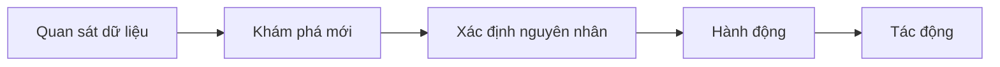
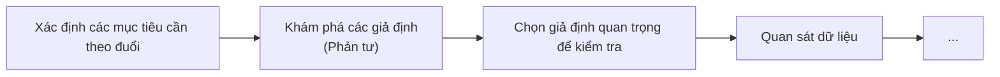

Hôm nay ngày 11/7/2026 tôi tham gia buổi chuyên đề "Kể chuyện bằng dữ liệu trong giáo dục" do [Lớp học đổi mới](https://www.facebook.com/lophocdoimoi) tổ chức. Tôi biết tới buổi này do một người chị trong nhóm ABG đã mua vé nhưng bị mệt đột xuất nên nhường lại cho ai có hứng thú. Tôi tham gia vì muốn biết thêm về những mối quan tâm của một người làm giáo dục, trong đó có việc sử dụng dữ liệu. Có thể xem đây là một phần trong nghiên cứu của tôi với chủ đề [Người làm dữ liệu nói gì về hạn chế của dữ liệu?](./D%E1%BB%AF%20li%E1%BB%87u%20%C4%91%E1%BA%BFn%20t%E1%BB%AB%20s%E1%BB%B1%20%C4%91%E1%BB%8Bnh%20l%C6%B0%E1%BB%A3ng%20c%E1%BB%A7a%20con%20ng%C6%B0%E1%BB%9Di%20ch%E1%BB%89%20s%E1%BB%AD%20d%E1%BB%A5ng%20th%E1%BB%91ng%20k%C3%AA.%20D%E1%BB%AF%20li%E1%BB%87u%20t%E1%BB%AB%20s%E1%BB%B1%20%C4%91o%20l%C6%B0%E1%BB%9Dng%20c%C3%A1c%20%C4%91%E1%BA%A1i%20l%C6%B0%E1%BB%A3ng%20v%E1%BA%ADt%20l%C3%BD%20d%C3%B9ng%20c%E1%BA%A3%20c%C3%A1c%20lo%E1%BA%A1i%20to%C3%A1n%20kh%C3%A1c.md) (Dữ liệu ở đây là nói tắt của dữ liệu định lượng.) 

Bài viết này không tổng hợp những gì đã diễn ra trong buổi trình bày, mà là tổng hợp những gì đã diễn ra trong đầu tôi, dựa trên những gì đã diễn ra trong buổi trình bày cùng với những gì tôi nghiên cứu thêm hoặc đã làm trước đó. Tôi không thu âm, ghi chép diễn biến buổi trình bày hay sử dụng mô hình ngôn ngữ lớn trong bất kỳ công đoạn nào. Có một khả năng là những ý như "chị Huyền nói" hay "anh Thiện chia sẻ" là tôi không nhớ đúng, dù tôi nghĩ khả năng này không cao. Vì thực ra ban đầu tôi không có ý tưởng sẽ đóng gói những ghi chú của mình thành một bài viết thế này; về tới nhà mới thấy việc viết ra như vậy sẽ tạo ra được nhiều tác động hơn. Tôi đoán văn bản này có thể được phân loại là một dạng điền dã nhân học nửa mùa. 

## Diễn giả là ai?
Theo thông tin từ [VN Express](https://vnexpress.net/tac-gia/tran-hung-thien-1797.html) và [Talent Connect Plus](https://talentconnectplus.edu.vn/member/tran-hung-thien/), anh **Trần Hùng Thiện** từng là phó tổng giám đốc mảng nghiên cứu đo lường hệ thống bán lẻ ở Neilsen. Công ty nghiên cứu thị trường do anh thành lập và làm CEO, [GCOMM](https://gcomm-global.com/), đã từng [được giới thiệu](https://www.youtube.com/watch?v=iidWZDSRJaY) tại Truyền hình Quốc hội Việt Nam.

Theo thông tin từ nhóm [Giáo dục Song ngữ cho Việt Nam](https://bev.edu.vn/nguyen-thi-thu-huyen/), chị **Nguyễn Thị Thu Huyền** từng làm cố vấn cao cấp, tổng hiệu trưởng cho một số trường quốc tế ở Việt Nam, từ mầm non đến THPT, hệ song ngữ. Hiện tại chị đang là cố vấn cao cấp, giám đốc chuyên môn cho một số hệ thống như Tân Thời Đại, Pathway Tuệ Đức, Mầm non Phú Đông Lotus, Mầm non Casa Montessori, v.v., cũng như là thành viên hội đồng thành viên của Teach for Viet Nam. Bạn có thể nghe tự sự về đam mê giáo dục của chị tại [đây](https://www.youtube.com/watch?v=8_SpHVEE11M).

## Nội dung chính
Do chỉ biết tới buổi này vài tiếng trước khi nó diễn ra nên tôi đã không đọc trước [bài giới thiệu](https://www.facebook.com/share/p/1GAsyhsWrJ/) hay diễn giả là ai. Vì thế, tôi đến với nó với một hình dung duy nhất về cách dữ liệu được ứng dụng trong giáo dục: chấm điểm học sinh. Nhưng ngay sau khi các diễn giả giới thiệu xong về mình và bước vào nội dung chính, câu đầu tiên anh Thiện nói đã đi ngược với hình dung ấy. Anh nói: mỗi ngôi trường giống như một công ty dữ liệu. Và dữ liệu trong đây toàn là dữ liệu xịn, vì nó:
- Gần như 100% là thật; nếu có không thật thì gần như chỉ là lỗi vô ý
- Tất cả đều là dữ liệu về hành động, chứ không phải là từ lời nói
- Diễn ra theo thời gian thực

Sau một lúc, tôi nhận ra đây là một cách dùng dữ liệu khác: dữ liệu về hành vi người dùng. Và người dùng ở đây là phụ huynh. Đây chính xác là cách một người làm phân tích dữ liệu hoặc phân tích kinh doanh nghĩ về dữ liệu. Và lĩnh vực chủ yếu là giáo dục tư chứ không phải là giáo dục công.

### Tuyển sinh
Tôi nhận ra rằng tình hình cạnh tranh giữa các trường tư là rất khốc liệt. Nhiều khi phụ huynh sau khi đã đã đóng tiền cọc ở một trường rồi, mà trường khác vẫn đến để tặng học bổng để việc trả cọc bên kia vẫn có lời cho phụ huynh. Hoặc một hình thức cạnh tranh khác là thông qua một loại học bổng có tên là "đồng hành": nếu trường mà phụ huynh đã đóng cọc lấy học phí thấp hơn, thì trường muốn giành khách sẵn sàng hạ học phí cho riêng học sinh đó ngang bằng với trường bị giành. Các trường sẵn sàng làm như vậy vì tỉ lệ quay lại của khách hàng là rất cao: một khi con đã học ở đâu thì phụ huynh sẽ muốn con mình tiếp tục học ở đó.

Tôi đồng ý rằng hành vi này không phải là xấu nếu như trường thực sự tin rằng mình chính là nơi phù hợp nhất cho trẻ. Để việc này xảy ra, đội tuyển sinh phải hiểu thật rõ triết lý, phương pháp của trường lẫn nhu cầu, mục tiêu của học sinh thì mới có thể kết luận được. Mà muốn vậy thì họ phải có thời gian đồng hành với cả trường và học sinh đủ lâu, và nếu họ thấy học sinh phù hợp với trường khác hơn thì thoải mái giới thiệu học sinh qua trường đó. Tôi phỏng đoán rằng điều này hiếm khi xảy ra trên thực tế.

Một lập luận khác để biện minh cho việc giành khách là việc muốn làm những điều lý tưởng thì phải tồn tại được trước đã. Tôi không biết vì sao các lý tưởng, triết lý giáo dục lại khó triển khai đến như vậy. Triết lý mà trường theo đuổi có nhất thiết chỉ tồn tại được trong thiết chế tư bản hay không? Nếu đúng là như vậy thì tại sao nó lại phù hợp với học sinh nhất so với các triết lý khác?

Đây là một số ý khác tôi thu nhặt được:
- Kênh tuyển sinh hiệu quả nhất là giáo viên
- Phụ huynh nhiều khi đã biết hết triết lý của trường rồi, nhưng vẫn muốn nghe chính miệng hiệu trưởng nói điều đó
- Trường tư phân khúc thấp không thể cạnh tranh lại được với trường công

### Dữ liệu trong quản lý chất lượng giáo dục
Để có một tập thể gắn kết thì những thành viên trong đó phải được cảm thấy đối xử công bằng. Và để có sự công bằng đòi hỏi sự minh bạch. Khi có sự minh bạch thì việc tuyên dương người có thành tích tốt không làm những người khác thấy ghen tị hay đố kị, và cũng làm giảm sự xấu hổ của người không có thành tích tốt khi phân tích vấn đề của họ. Mà [Số liệu định lượng tạo ra cảm giác minh bạch rất tốt](../../../Qu%E1%BA%A3n%20l%C3%BD%20d%E1%BB%B1%20%C3%A1n,%20ph%C3%A1t%20tri%E1%BB%83n%20s%E1%BA%A3n%20ph%E1%BA%A9m,%20x%C3%A2y%20d%E1%BB%B1ng%20t%E1%BB%95%20ch%E1%BB%A9c/X%C3%A2y%20d%E1%BB%B1ng%20nh%C3%B3m,%20qu%E1%BA%A3n%20l%C3%BD%20nh%C3%A2n%20s%E1%BB%B1/T%E1%BA%A1o%20s%E1%BB%B1%20tin%20t%C6%B0%E1%BB%9Fng/S%E1%BB%91%20li%E1%BB%87u%20%C4%91%E1%BB%8Bnh%20l%C6%B0%E1%BB%A3ng%20t%E1%BA%A1o%20ra%20c%E1%BA%A3m%20gi%C3%A1c%20minh%20b%E1%BA%A1ch%20r%E1%BA%A5t%20t%E1%BB%91t.md), vì nó xóa bỏ cái cảm giác cảm tính. Thế nên, việc dùng số liệu được khuyến khích trong việc quản lý chất lượng giáo dục. 

Tôi thấy có 3 dạng sử dụng dữ liệu được sử dụng:
- **Dữ liệu từ thang đo.** VD: điểm số ở học sinh, điểm dự giờ của một giáo viên, bộ chỉ số đánh giá bắt buộc phải công khai của các trường, v.v.
- **Dữ liệu từ thống kê từ thang đo.** VD: tỉ lệ học sinh điểm thấp của một giáo viên hay một khối lớp, chỉ số sáng tạo trung bình của giáo viên của trường v.v.
- **Dữ liệu từ thống kê hành vi.** VD: số ngày thứ Hai học sinh đi trễ liên tiếp, v.v.

#### Dữ liệu từ thang đo
Điểm số có vai trò phân loại khách thể. Ví dụ như đối với học sinh thì cần giúp giáo viên biết được học sinh nào: 
- Cần củng cố nền tảng
- Đang quá tải
- Có nguy cơ tụt lại
- Có tiềm năng nhưng thiếu động lực
- Có thể được thử thách ở mức cao hơn

Với giáo viên thì cũng tương tự vậy. Chính vì như vậy, nên dù các con số trông như có vẻ tuyến tính, nhưng khoảng cách từ điểm 7 lên điểm 8 có thể rất khác với khoảng cách từ điểm 8 lên điểm 9. Nói theo ngôn ngữ thống kê, điểm số là thang đo khoảng, nhưng nó lại được dùng như một thang đo danh nghĩa. Tức là râu ông này cắm cằm bà kia. Tôi thấy rằng việc làm này sẽ tạo ra nhiều ảo tưởng thống kê, không chỉ ở điểm số mà còn ở bất kỳ các thống kê nào dựa trên nó.

Đánh giá giáo dục ([educational assessment](https://en.wikipedia.org/wiki/Educational_assessment)) là một mảng rộng mà tôi chưa tìm hiểu gì cả, nhưng nhìn thoáng qua một số barem hoặc [rubric](https://en.wikipedia.org/wiki/Rubric_(academic)) chấm điểm, tôi cảm giác chúng là một dạng của phương pháp phân tích quyết định đa tiêu chí (Multicriteria Decision Analysis – MCDA). Cách làm của nó là chấm điểm từng tiêu chí nhỏ, rồi gộp các con số đó lại thành một con số cuối cùng. [Phương pháp này có tác dụng tốt trong việc tìm lựa chọn tối ưu (cân bằng được các đánh đổi) và có thể sắp xếp các lựa chọn đó theo thứ tự từ trên xuống dưới.](../../../Qu%E1%BA%A3n%20l%C3%BD%20d%E1%BB%B1%20%C3%A1n,%20ph%C3%A1t%20tri%E1%BB%83n%20s%E1%BA%A3n%20ph%E1%BA%A9m,%20x%C3%A2y%20d%E1%BB%B1ng%20t%E1%BB%95%20ch%E1%BB%A9c/X%C3%A2y%20d%E1%BB%B1ng%20nh%C3%B3m,%20qu%E1%BA%A3n%20l%C3%BD%20nh%C3%A2n%20s%E1%BB%B1/Th%E1%BA%A3o%20lu%E1%BA%ADn,%20ra%20quy%E1%BA%BFt%20%C4%91%E1%BB%8Bnh/Ph%C3%A2n%20t%C3%ADch%20quy%E1%BA%BFt%20%C4%91%E1%BB%8Bnh%20%C4%91a%20ti%C3%AAu%20ch%C3%AD%20(MCDA)%20l%C3%A0%20ph%C6%B0%C6%A1ng%20ph%C3%A1p%20%C4%91%E1%BB%83%20t%C3%ACm%20%C4%91i%E1%BB%83m%20%C4%91%C3%A1nh%20%C4%91%E1%BB%95i%20t%E1%BB%91i%20%C6%B0u%20nh%E1%BA%A5t,%20v%C3%A0%20c%C3%B3%20th%E1%BB%83%20s%E1%BA%AFp%20x%E1%BA%BFp%20c%C3%A1c%20l%E1%BB%B1a%20ch%E1%BB%8Dn%20theo%20th%E1%BB%A9%20t%E1%BB%B1%20gi%E1%BA%A3m%20d%E1%BA%A7n.md) Nó rất phù hợp với các mục đích mang tính tuyển chọn như thi đại học hay phỏng vấn nhận việc. Nhưng tôi thấy mục đích của việc cho điểm học sinh hay giáo viên không phải là để chọn ai loại ai, mà là để có cách hỗ trợ họ phù hợp. Có vẻ như phương pháp này không được thiết kế cho mục đích như vậy.

Ví dụ, trong môn tiếng Anh ta có 4 kỹ năng nghe, nói, đọc, viết. Giả sử điểm kỹ năng của học sinh A là (6, 7, 8, 7), và của học sinh B là (5, 4, 9, 10). Nếu điểm cuối cùng là trung bình cộng của bốn kỹ năng, thì cả hai đều là 7. Nhưng để ý là kỹ năng của học sinh A là tương đối đều, trong khi học sinh B điểm nghe nói thấp, trong khi điểm đọc viết lại rất cao. Có thể thiên hướng của em mạnh về việc thao tác trên văn bản, hoặc em không phải là một người thích trò chuyện với người khác. Nếu không biết được các điểm thành phần thì sẽ chỉ hỗ trợ các em như nhau chứ không có thêm được các giả định tốt hơn. [Giả định đến từ trực giác](../../../Ngh%C4%A9%20v%E1%BB%81%20vi%E1%BB%87c%20ngh%C4%A9/Hi%E1%BB%83u%20bi%E1%BA%BFt/Gi%E1%BA%A3%20%C4%91%E1%BB%8Bnh%20%C4%91%E1%BA%BFn%20t%E1%BB%AB%20tr%E1%BB%B1c%20gi%C3%A1c.md).

Tôi nghĩ giải pháp cũng đơn giản thôi: giữ nguyên cả bộ số, không gộp lại thành một con số. Nếu việc chấm điểm mỗi kỹ năng đòi hỏi phải chấm điểm các tiêu chí nhỏ hơn, thì cũng chỉ ghi điểm của các tiêu chí thành phần chứ không gộp lại thành điểm của một kỹ năng. Nhưng điều này có một nhược điểm là thay vì chỉ cần ghi nhớ, lưu trữ, sử dụng một con số, nay ta phải làm vậy với cả một bộ số. Giả sử mỗi kỹ năng trong môn tiếng Anh lại có 4 tiêu chí để đánh giá, thì mỗi lần chấm điểm kết quả sẽ là nguyên một ma trận 4×4. Không chỉ số lượng con số tăng lên gấp 16 lần, mà các thao tác xử lý dữ liệu tiếp theo cũng phải trên ma trận chứ không phải trên số. Tôi đoán đây là lý do chủ yếu khiến cho cách đánh giá bằng con số lại được phổ biến đến như vậy. [Sự sẵn sàng và tiện lợi luôn áp đảo hơn sự chính xác](../../../Ngh%C4%A9%20v%E1%BB%81%20vi%E1%BB%87c%20ngh%C4%A9/G%C3%A1nh%20n%E1%BA%B7ng%20nh%E1%BA%ADn%20th%E1%BB%A9c.%20Thi%E1%BA%BFt%20k%E1%BA%BF/T%C3%ACm%20ki%E1%BA%BFm%20th%C3%B4ng%20tin/S%E1%BB%B1%20s%E1%BA%B5n%20s%C3%A0ng%20v%C3%A0%20ti%E1%BB%87n%20l%E1%BB%A3i%20lu%C3%B4n%20%C3%A1p%20%C4%91%E1%BA%A3o%20h%C6%A1n%20s%E1%BB%B1%20ch%C3%ADnh%20x%C3%A1c.md).

Đa phần mọi người sẽ ngần ngại khi nghe về ma trận, nhưng bảng tính cũng là ma trận; bản thân việc bảng điểm của các học sinh trong một lớp cũng đã là một ma trận rồi. Nếu đã biết làm Excel rồi thì cũng không có gì phải sợ. Tôi nghĩ rằng việc lưu trữ dữ liệu trên máy tính thay vì trên giấy sẽ giải quyết được tình trạng ngộp số liệu này. Phần về hệ thống thông tin sẽ trình bày rõ hơn.

Ở trên chỉ mới nói về vấn đề điểm đánh giá có được thiết kế đúng cho mục đích của nó hay không. Nhưng đó không phải là vấn đề duy nhất của nó. Các con số này còn chịu nhiều sức ép khiến cho chúng dễ bị sai lệch. Ví dụ như ở học sinh:
- Điểm không tốt làm học sinh thấy tự ti, đặc biệt là ở tiểu học. Với các trẻ gặp khó khăn trong việc học tập (VD: gặp chứng khó đọc chữ), thì ở các trường công trẻ còn được cộng thêm điểm. Đây là vấn đề về hòa nhập, tránh gây phân biệt đối xử
- Con cái buồn rầu thì cha mẹ cũng không vui. Mà cha mẹ phụ huynh thì  là khách hàng. Làm khách không vui thì có khi... mất khách
- Điểm đẹp giúp việc chuyển cấp của học sinh thuận lợi hơn

Còn với ở giáo viên:
- Giáo viên khi được dự giờ có khuynh hướng phô diễn kỹ năng trình bày, nhưng không nhất thiết là có hiệu quả ở học sinh
- Số lượng câu hỏi trong bảng đánh giá dự giờ không nên quá nhiều, nếu không thì chính người dự giờ cũng không xử lý được. Tầm 20 cái là vừa

Tôi đoán hẳn là phải có nhiều phân tích về vấn đề này rồi, nhưng do thời gian có hạn tôi chưa đọc được.

#### Dữ liệu từ thống kê
Bởi vì tôi thấy việc tổng hợp các đánh giá từ nhiều tiêu chí lại thành một điểm số chỉ hợp lý khi những người có điểm số đó đang cạnh tranh lẫn nhau, nên các thống kê về điểm số cũng chỉ có ý nghĩa khi sử dụng những loại điểm số mang tính cạnh tranh. Còn các thống kê từ các điểm số không được dùng với mục đích cạnh tranh thì tôi không biết việc dùng nó có ý nghĩa thế nào. Đây là vài ví dụ của loại thống kê mà tôi nghi vấn về tính hợp lý:
- Tỉ lệ học sinh có điểm thi giữa kỳ thấp của một giáo viên
- Chỉ số sáng tạo trung bình của giáo viên của trường

Còn những thống kê về hành vi, hoặc từ các điểm số được dùng để cạnh tranh thì có lẽ là hợp lý hơn. Ví dụ:
- Tỉ lệ học sinh có điểm thấp trong kỳ thi vào lớp 10
- Số giáo viên có điểm thấp ở một kỹ năng hoặc tiêu chí cụ thể
- Trung bình học sinh đi trễ vào sáng thứ Hai trong tháng vừa rồi

Nhưng thôi, cứ tạm bỏ qua chuyện đó và giả sử là tất cả các loại thống kê đều dùng được. Dù sao thì tôi cũng chưa tìm hiểu về giáo dục học nói chung, và thống kê giáo dục nói riêng. Nói chung, tôi đồng ý là có được số liệu thì hữu ích, giúp ta phát hiện được những vấn đề mà nếu không có thì khó mà thấy được. Ví dụ, nhờ phân tích dữ liệu mà ta phát hiện được gian lận điểm thi:
<iframe width="560" height="315" src="https://www.youtube.com/embed/CQJ_SxZ0rIE?si=2zq0m7Zv3cIgjAfh" title="YouTube video player" frameborder="0" allow="accelerometer; autoplay; clipboard-write; encrypted-media; gyroscope; picture-in-picture; web-share" referrerpolicy="strict-origin-when-cross-origin" allowfullscreen></iframe>

Theo tôi hiểu, thống kê giáo dục về cơ bản cũng là một mảng của thống kê xã hội. Tới lượt nó, thống kê xã hội cũng là một mảng của thống kê. Nên để có một đánh giá tốt cần hiểu được một số nguyên tắc thống kê, và nhận thức được các giới hạn của thống kê.

Thông thường, khi làm việc với một bộ số liệu ta hay tìm giá trị trung bình của chúng. Nhưng khi làm vậy, ta sẽ bị mất thông tin về *độ phân tán* của chúng. Ví dụ, một lớp 30 học sinh, nhưng một lớp có tất cả học sinh đều đạt điểm 7 khác với một lớp có 10 học sinh đạt điểm 6, 10 học sinh đạt điểm 7, 10 học sinh đạt điểm 8. Nếu chỉ ghi điểm trung bình của lớp thì chưa mô tả được hết các thông tin của mẫu. Hoặc ví dụ về việc chấm điểm môn tiếng Anh ở trên cũng tương tự.

Nên nếu nhất thiết việc cho điểm chỉ đưa ra một con số làm đại diện, thì có lẽ việc có thêm một con số phụ cho biết độ phân tán của các tiêu chí thành phần sẽ là hữu ích. Trong thống kê, con số này gọi là *độ lệch chuẩn*. Có thể giáo viên cũng dễ dàng phát hiện ra sự khác biệt về năng lực giữa các học sinh, hoặc giữa các kỹ năng của một học sinh, nên ta có thể cảm thấy là việc ghi thêm độ lệch chuẩn là không cần thiết. Nhưng nếu vậy thì ngay cả việc cho điểm cũng đã là không cần thiết rồi. Nên mục đích ghi ra không phải là để cho người làm việc trực tiếp với học sinh, mà là cho những người không làm việc trực tiếp, những người không có cùng trải nghiệm với giáo viên có sự nắm bắt sát hơn.

Tại sao ở phần trên tôi thấy việc tổng hợp một bộ số thành một con số không có ý nghĩa, nhưng ở đây thì lại không có vấn đề gì? Bởi vì trong việc chấm điểm, mỗi tiêu chí là đánh giá một thứ khác nhau. Tức là chúng khác đơn vị đo. Nó giống như việc tính `1 m + 1 kg` vậy; nó là một phép tính không có nghĩa. (Việc dùng phương pháp MCDA thì lại được, vì phép tính là phép nhân. `1 m × 1 kg = 1 m.kg` là một phép tính có nghĩa.) Còn ở phần này điểm số của mỗi học sinh lại là cùng một đơn vị đo, nên có thể lấy trung bình được.

Các diễn giả nhấn mạnh là các con số tự thân nó không có ý nghĩa, mà phải đem so sánh với các con số khác. Có thể là với chính con số đó của học sinh/giáo viên/trường trong quá khứ, hoặc với những học sinh/giáo viên/trường khác. Có thể hiểu việc so sánh này cũng là so sánh độ lệch chuẩn của chúng.

#### Các bước sử dụng dữ liệu
Buổi chuyên đề liệt kê các câu hỏi để nhà trường biết cách làm tăng hiệu quả hoạt động của mình trong các mảng khác nhau, như tuyển sinh, trải nghiệm phụ huynh, chất lượng giảng dạy, quản trị giáo viên & phát triển chuyên môn, v.v. Trong giới hạn thời gian của chương trình và với mục tiêu ứng dụng được ngay thì tôi nghĩ là đủ với tệp khán giả mục tiêu, nhưng nếu là tôi thì tôi sẽ muốn bổ sung thêm một số ý sau:
- Làm sao để đặt được những câu hỏi mình cần hỏi?
- Câu hỏi nào thì nên trả lời trước?
- Làm sao để trả lời câu hỏi?
- Cần dữ liệu gì để trả lời câu hỏi?

Để đặt được câu hỏi mình cần hỏi, đầu tiên phải xem xem mục tiêu của mình là gì, và liệt kê các giả định mình đang có. Khi làm vậy bạn sẽ thấy [giả định có mặt ở khắp nơi](../../../Qu%E1%BA%A3n%20l%C3%BD%20d%E1%BB%B1%20%C3%A1n,%20ph%C3%A1t%20tri%E1%BB%83n%20s%E1%BA%A3n%20ph%E1%BA%A9m,%20x%C3%A2y%20d%E1%BB%B1ng%20t%E1%BB%95%20ch%E1%BB%A9c/Ph%C3%A1t%20tri%E1%BB%83n%20s%E1%BA%A3n%20ph%E1%BA%A9m/Ki%E1%BB%83m%20%C4%91%E1%BB%8Bnh%20gi%E1%BA%A3%20thuy%E1%BA%BFt/Gi%E1%BA%A3%20%C4%91%E1%BB%8Bnh%20c%C3%B3%20m%E1%BA%B7t%20%E1%BB%9F%20kh%E1%BA%AFp%20n%C6%A1i.md). Ví dụ, nếu một trường định vị bản thân là học sinh học ở đây sẽ dùng tốt tiếng Anh, thì sẽ có các giả định là:
- Trường tôi có khả năng dạy trẻ dùng tốt tiếng Anh
- Học sinh tôi tuyển có khả năng dùng tốt tiếng Anh
- Phụ huynh không nhất thiết phải có nhu cầu cho con mình học tốt tiếng Anh, nhưng nếu có thì đó là một lợi thế
- v.v.

Đến lượt giả định "Trường tôi có khả năng dạy trẻ dùng tốt tiếng Anh" sẽ có nhiều giả định nhỏ hơn như:
- Giáo viên có khả năng dạy trẻ dùng tốt tiếng Anh ứng tuyển vào trường tôi
- Cơ sở vật chất có khả năng hỗ trợ giáo viên và học
- v.v.

Sau khi liệt kê được muôn vàn các giả định như vậy rồi thì mới bắt đầu chọn ra các giả định cần kiểm chứng nhất. Đến đây mới là lúc ta sử dụng dữ liệu để chấp nhận hoặc bác bỏ giả thiết. [Cần nghĩ về công việc như là một cách để kiểm định giả thiết, chứ không phải chỉ để hoàn thành](../../../Qu%E1%BA%A3n%20l%C3%BD%20d%E1%BB%B1%20%C3%A1n,%20ph%C3%A1t%20tri%E1%BB%83n%20s%E1%BA%A3n%20ph%E1%BA%A9m,%20x%C3%A2y%20d%E1%BB%B1ng%20t%E1%BB%95%20ch%E1%BB%A9c/C%C3%B4ng%20vi%E1%BB%87c/C%E1%BA%A7n%20ngh%C4%A9%20v%E1%BB%81%20c%C3%B4ng%20vi%E1%BB%87c%20nh%C6%B0%20l%C3%A0%20m%E1%BB%99t%20c%C3%A1ch%20%C4%91%E1%BB%83%20ki%E1%BB%83m%20%C4%91%E1%BB%8Bnh%20gi%E1%BA%A3%20thi%E1%BA%BFt,%20ch%E1%BB%A9%20kh%C3%B4ng%20ph%E1%BA%A3i%20ch%E1%BB%89%20%C4%91%E1%BB%83%20ho%C3%A0n%20th%C3%A0nh.md). [Nên ưu tiên làm những việc có thể sẽ khiến ta phải viết lại kế hoạch](../../../Qu%E1%BA%A3n%20l%C3%BD%20d%E1%BB%B1%20%C3%A1n,%20ph%C3%A1t%20tri%E1%BB%83n%20s%E1%BA%A3n%20ph%E1%BA%A9m,%20x%C3%A2y%20d%E1%BB%B1ng%20t%E1%BB%95%20ch%E1%BB%A9c/C%C3%B4ng%20vi%E1%BB%87c/S%E1%BA%AFp%20x%E1%BA%BFp%20%C4%91%E1%BB%99%20%C6%B0u%20ti%C3%AAn/L%C3%AAn%20k%E1%BA%BF%20ho%E1%BA%A1ch/N%C3%AAn%20%C6%B0u%20ti%C3%AAn%20l%C3%A0m%20nh%E1%BB%AFng%20vi%E1%BB%87c%20c%C3%B3%20th%E1%BB%83%20s%E1%BA%BD%20khi%E1%BA%BFn%20ta%20ph%E1%BA%A3i%20vi%E1%BA%BFt%20l%E1%BA%A1i%20k%E1%BA%BF%20ho%E1%BA%A1ch.md).

Cho nên, với mô hình 5 giai đoạn sử dụng dữ liệu được đề xuất trong buổi trình bày:

Tôi đề xuất bổ sung thêm 3 giai đoạn vào phía trước:

Với các giả định thông dụng, buổi chuyên đề có thể cung cấp thêm các bộ chỉ số để việc quan sát dữ liệu được dễ dàng hơn. Các khung đánh giá năng lực mà Bộ Giáo dục và Đào tạo hay UNESCO cung cấp là một ví dụ. Các hội, tổ chức làm về giáo dục cũng có thể nghiên cứu ra các thang đo để phổ biến cho nhà trường, giáo viên sử dụng.

### Nhận thức và thái độ của người dùng dữ liệu đối với các hạn chế của nó
Bài viết [The Limits of Data](https://issues.org/limits-of-data-nguyen/) chắc là tổng kết khá đầy đủ các hạn chế của dữ liệu:
- Không nắm bắt được những thứ khó đo lường
- Dữ liệu định tính sẽ bị loại bỏ khi tổng hợp
- Hệ thống phân loại cứng nhắc, kém bao hàm
- Thiên kiến hệ thống ảnh hưởng đến cách chọn mẫu
- Quá tập trung vào một chỉ số

Trong vấn đề quản lý, tôi sẽ bổ sung thêm [Định luật Goodhart: "Khi một phép đo trở thành mục tiêu, nó thường mất đi sự hiệu quả của nó"](../../../Qu%E1%BA%A3n%20l%C3%BD%20d%E1%BB%B1%20%C3%A1n,%20ph%C3%A1t%20tri%E1%BB%83n%20s%E1%BA%A3n%20ph%E1%BA%A9m,%20x%C3%A2y%20d%E1%BB%B1ng%20t%E1%BB%95%20ch%E1%BB%A9c/Ph%C3%A1t%20tri%E1%BB%83n%20s%E1%BA%A3n%20ph%E1%BA%A9m/Ch%E1%BB%89%20s%E1%BB%91/Khi%20m%E1%BB%99t%20ph%C3%A9p%20%C4%91o%20tr%E1%BB%9F%20th%C3%A0nh%20m%E1%BB%A5c%20ti%C3%AAu,%20n%C3%B3%20th%C6%B0%E1%BB%9Dng%20m%E1%BA%A5t%20%C4%91i%20s%E1%BB%B1%20hi%E1%BB%87u%20qu%E1%BA%A3%20c%E1%BB%A7a%20n%C3%B3.md). [Thứ nào được đo thì sẽ tốt lên, còn thứ nào khó đo thì sẽ tệ đi](../../../Qu%E1%BA%A3n%20l%C3%BD%20d%E1%BB%B1%20%C3%A1n,%20ph%C3%A1t%20tri%E1%BB%83n%20s%E1%BA%A3n%20ph%E1%BA%A9m,%20x%C3%A2y%20d%E1%BB%B1ng%20t%E1%BB%95%20ch%E1%BB%A9c/Ph%C3%A1t%20tri%E1%BB%83n%20s%E1%BA%A3n%20ph%E1%BA%A9m/Ch%E1%BB%89%20s%E1%BB%91/Th%E1%BB%A9%20n%C3%A0o%20%C4%91%C6%B0%E1%BB%A3c%20%C4%91o%20th%C3%AC%20s%E1%BA%BD%20t%E1%BB%91t%20l%C3%AAn,%20c%C3%B2n%20th%E1%BB%A9%20n%C3%A0o%20kh%C3%B3%20%C4%91o%20th%C3%AC%20s%E1%BA%BD%20t%E1%BB%87%20%C4%91i.md). 

Sau khi hết buổi chuyên đề, tôi có hỏi anh Thiện là có biết nguồn tài liệu nào có trả lời câu hỏi "[Người làm dữ liệu nói gì về sự thiếu sót của dữ liệu?](./D%E1%BB%AF%20li%E1%BB%87u%20%C4%91%E1%BA%BFn%20t%E1%BB%AB%20s%E1%BB%B1%20%C4%91%E1%BB%8Bnh%20l%C6%B0%E1%BB%A3ng%20c%E1%BB%A7a%20con%20ng%C6%B0%E1%BB%9Di%20ch%E1%BB%89%20s%E1%BB%AD%20d%E1%BB%A5ng%20th%E1%BB%91ng%20k%C3%AA.%20D%E1%BB%AF%20li%E1%BB%87u%20t%E1%BB%AB%20s%E1%BB%B1%20%C4%91o%20l%C6%B0%E1%BB%9Dng%20c%C3%A1c%20%C4%91%E1%BA%A1i%20l%C6%B0%E1%BB%A3ng%20v%E1%BA%ADt%20l%C3%BD%20d%C3%B9ng%20c%E1%BA%A3%20c%C3%A1c%20lo%E1%BA%A1i%20to%C3%A1n%20kh%C3%A1c.md)", thì anh bảo là cứ lên trang [Brand Camp](https://www.brandcamp.asia/) sẽ có bài về nó. Tuy nhiên tôi tìm thì không thấy nơi nào nói về điều đó. Tôi hỏi câu tương tự với chị Huyền, thì chị lại hiểu thành "Người làm giáo dục thiếu dữ liệu nào nhất". Nhưng sau đó chị cũng cho tôi thêm một số ý.

Nói chung, tuy không có một phần riêng về hạn chế của dữ liệu, tôi thấy các diễn giả cũng có nói rải rác một số ý như sau:
- Luôn xem dữ liệu chỉ mang tính tham khảo, cần dùng thêm nhiều đánh giá khác
- Giáo viên, người quản lý có quan tâm đến học sinh, giáo viên sẽ phát hiện ra ngay vấn đề thông qua hành vi
- Không dùng dữ liệu để xếp hạng, so sánh máy móc, tạo áp lực báo cáo, mà dùng để xác định nhu cầu, chia sẻ phương pháp hay, tìm hiểu nguyên nhân vấn đề, v.v.
- Với những người lo lắng là việc minh bạch dữ liệu gây bất lợi cho họ, phải cho họ thấy mình quan tâm đến họ thật lòng

Đây là một cách quản lý bằng dữ liệu khác, không giống với cách quản lý bằng KPI mà bộ phận bán hàng thường phải gặp.

Nhưng nói chung, nếu mọi con số đều chỉ mang tính tham khảo, thì phải chăng nó vốn đã chẳng khách quan, lý tính như nó đang được tin tưởng là vậy? Phải chăng việc dùng số liệu là một cách để những người dùng nó tự đánh lừa bản thân là mình khách quan, không cảm tính? [Mọi người vẫn nói là các con số không nói dối, nhưng chúng nói nửa sự thật, và người nói dối dùng con số](../../../Qu%E1%BA%A3n%20l%C3%BD%20d%E1%BB%B1%20%C3%A1n,%20ph%C3%A1t%20tri%E1%BB%83n%20s%E1%BA%A3n%20ph%E1%BA%A9m,%20x%C3%A2y%20d%E1%BB%B1ng%20t%E1%BB%95%20ch%E1%BB%A9c/Ph%C3%A1t%20tri%E1%BB%83n%20s%E1%BA%A3n%20ph%E1%BA%A9m/Ch%E1%BB%89%20s%E1%BB%91/Con%20s%E1%BB%91%20kh%C3%B4ng%20n%C3%B3i%20d%E1%BB%91i,%20nh%C6%B0ng%20n%C3%B3%20n%C3%B3i%20n%E1%BB%ADa%20s%E1%BB%B1%20th%E1%BA%ADt,%20v%C3%A0%20ng%C6%B0%E1%BB%9Di%20n%C3%B3i%20d%E1%BB%91i%20d%C3%B9ng%20con%20s%E1%BB%91.md). Hay nói như câu thường được cho là của Mark Twain: "Có 3 loại nói dối: nói dối, nói dối khốn nạn, và thống kê." Tôi nghĩ những điều này cũng nên được nói trong một buổi nói về dữ liệu.

### Các yêu cầu chức năng cho một hệ thống quản trị
Từ những vấn đề được nêu lên ở trên, ta có thể thấy một hệ thống quản trị tốt phải đáp ứng được các yêu cầu sau:
- Giúp khám phá và quản lý được các giả định đang sử dụng
- Dễ dàng cập nhật dữ liệu mới, truy vấn và tổng hợp dữ liệu đang có
	- Mỗi khi kế hoạch, thang đo được cập nhật mới thì mọi số liệu sẽ được tính toán lại
	- Chuyển giao, liên thông dữ liệu với các cơ sở khác, kể cả khi cơ sở đó không thuộc hệ thống của mình một cách dễ dàng
	- Ngăn chặn sai sót và sự lây lan của sai sót
- Giảm các hạn chế của việc dùng dữ liệu:
	- Nhắc nhở việc phải sử dụng nhiều chỉ số để đánh giá, về sự tồn tại những thứ quan trọng nhưng khó đo lường
	- Không loại bỏ dữ liệu định tính khi tổng hợp
	- Không gộp dữ liệu của các tiêu chí nhỏ vào một con số nếu mục đích không phải là để cạnh tranh
- Tạo điều kiện để việc thống kê và diễn giải thống kê chính xác và dễ dàng hơn:
	- Năng lực của cá nhân được biểu diễn dưới dạng ma trận, thay vì số
	- Cung cấp thêm độ lệch chuẩn bên cạnh trung bình cộng
- Bảo mật. Đảm bảo được sự cân bằng giữa minh bạch và riêng tư
- Nếu nhà trường không triển khai thì giáo viên cũng có thể tự sử dụng mà không phải tốn quá nhiều chi phí để có được hệ thống cũng như thời gian để học 

## Gây quỹ từ thiện
> Toàn bộ chương trình được tổ chức với mục đích gây quỹ ủng hộ Trường Tiểu học Húc (Quảng Trị) và Mái ấm Thiên Thần (TP.HCM).

Do buổi chuyên đề hướng tới tư duy sử dụng dữ liệu, để có thể chuyển đổi tư duy từ "Tôi nghĩ là..." sang "Đâu là bằng chứng cho thấy đây là lựa chọn tốt nhất?", tôi cũng tò mò xem các diễn giả đã ứng dụng dữ liệu cho việc từ thiện của mình chưa, và đã dùng nó thế nào. Nó có:
- Tránh được việc lệ thuộc ở người nhận, và ganh tị ở người không được nhận, từ đó phá vỡ cộng đồng?
- Cho thứ họ cần, chứ không phải cho thứ mình muốn cho?
- Đem lại sự thay đổi bền vững không?