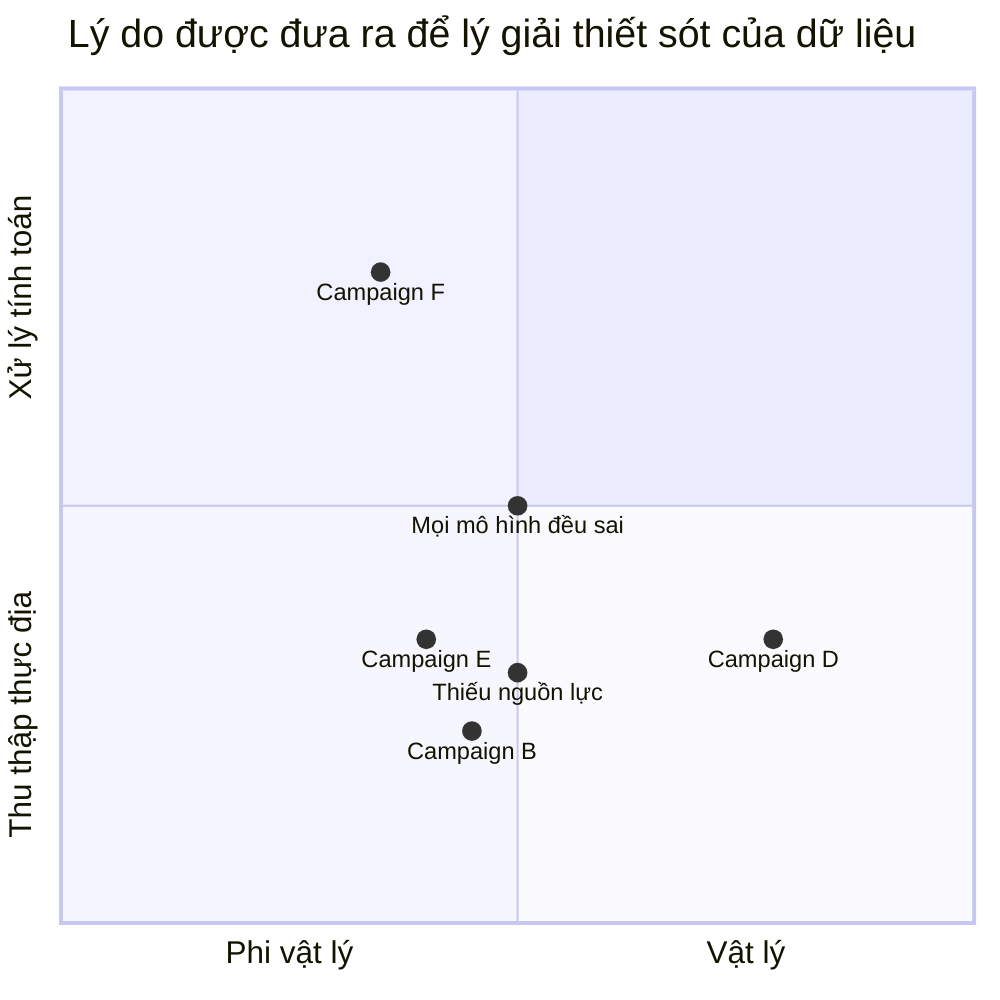

# Người làm dữ liệu đối diện với sự thiếu sót của dữ liệu thế nào?
Bài viết [The Limits of Data](https://issues.org/limits-of-data-nguyen/):
- Không nắm bắt được những thứ khó đo lường
- Dữ liệu định tính sẽ bị loại bỏ khi tổng hợp
- Hệ thống phân loại cứng nhắc, kém bao hàm
- Thiên kiến hệ thống ảnh hưởng đến cách chọn mẫu
- Quá tập trung vào một chỉ số

Lập luận người thép. Hãy cùng xem xét coi 

## Làm rõ câu hỏi
Vấn đề về tính đáng tin của dữ liệu và kết quả phân tích, không phải các vấn đề khác như tính riêng tư, tính sở hữu, tính pháp lý, tính lưu trữ của dữ liệu.

Đầu tiên, bài viết tập trung vào những **dữ liệu định lượng**, không phải dữ liệu định tính, không phải hệ thống dữ liệu

Giả định rằng người làm dữ liệu thành thật, không cố tình chế dữ liệu
Câu hỏi là nói về dữ liệu, không phải thông tin. 
Sẽ chỉ xét vê 
Nên sẽ không xét hệ thống dữ liệu

## Phần 1: Ai là "người làm dữ liệu"?

Với phân tích trên, ta có thể chia thành những loại người được xem là "người làm dữ liệu" sau:
Phân theo công việc:
- Người thu thập dữ liệu thực địa
- Người làm thống kê
- Người làm máy học

Phân theo mục đích sử dụng:
- Nghiên cứu
- Quản lý và ra quyết định
- Dự đoán

Phân theo lĩnh vực:
- Khoa học xã hội
- Khoa học tự nhiên
Phân theo loại dữ liệu:
- Có thể lập mô hình tính toán
- Không thể lập mô hình tính toán

Phân theo thang đo:
- Danh nghĩa
- Thứ bậc
- Khoảng
- Tỉ lệ

[Phân biệt các loại thang đo trong nghiên cứu - Hệ thống thông tin Thống kê KH&amp;CN](https://thongke.cesti.gov.vn/dich-vu-thong-ke/tai-lieu-phan-tich-thong-ke/720-phan-biet-thang-do-trong-nghien-cuu)

### Người thu thập dữ liệu thực địa
Vấn đề nằm ở nguồn lực để đảm bảo động lực của đáp viên và nhân viên khảo sát không làm ảnh hưởng đến chất lượng dữ liệu.
- Không có mẫu đa dạng
- Đáp viên làm cho có
- Nhân viên khảo sát chỉ làm cho xong việc

lướt lẹ, thấy đáp viên lưỡng lự, thắc mắc về sự cứng nhắc của khảo sát thì chọn giùm cho đáp viên luôn

### Người làm thống kê
Người làm phân tích dữ liệu có lẽ chỉ nghĩ đến việc lấy mẫu, độ tin cậy. Làm sạch, biến đổi, thu gọn dữ liệu. Nếu mọi thứ làm đúng thì dữ liệu là đáng tin
Vấn đề, nếu có, nằm ở lấy mẫu và kỹ thuật phân tích. 
Có lẽ cũng thường xuyên tự hỏi là hàm quy hồi này có đúng không. Nhưng dự đoán có sai số thấp quá rồi thì tin thôi

Thống kê bắt đầu bằng việc có các điểm trong không gian, chứ không nói các điểm đó từ đâu ra. [Unit of observation](https://en.wikipedia.org/wiki/Unit_of_observation#Data_point). Nếu người thu thập dữ liệu tại thực địa không phản ánh 

[Statistical assumption](https://en.wikipedia.org/wiki/Statistical_assumption)
[Statistical model](https://en.wikipedia.org/wiki/Statistical_model)

### Người làm máy học
Vấn đề nằm ở tham số

|                   | Phi vật lý           | Vật lý               |
| ----------------- | -------------------- | -------------------- |
| Thu thập thực địa | `Không đủ nguồn lực` | `Không đủ nguồn lực` |
| Xử lý tính toán   |                      |                      |

[Ngành khoa học dữ liệu còn nhiều thuật ngữ không có sự ổn định về nghĩa](./Khoa%20h%E1%BB%8Dc%20d%E1%BB%AF%20li%E1%BB%87u/Ng%C3%A0nh%20khoa%20h%E1%BB%8Dc%20d%E1%BB%AF%20li%E1%BB%87u%20c%C3%B2n%20nhi%E1%BB%81u%20thu%E1%BA%ADt%20ng%E1%BB%AF%20kh%C3%B4ng%20c%C3%B3%20s%E1%BB%B1%20%E1%BB%95n%20%C4%91%E1%BB%8Bnh%20v%E1%BB%81%20ngh%C4%A9a.md). Thậm chí có người còn cho rằng [cái gọi là khoa học dữ liệu đúng ra chỉ là kỹ thuật dữ liệu](./Khoa%20h%E1%BB%8Dc%20d%E1%BB%AF%20li%E1%BB%87u/C%C3%A1i%20g%E1%BB%8Di%20l%C3%A0%20khoa%20h%E1%BB%8Dc%20d%E1%BB%AF%20li%E1%BB%87u%20%C4%91%C3%BAng%20ra%20ch%E1%BB%89%20l%C3%A0%20k%E1%BB%B9%20thu%E1%BA%ADt%20d%E1%BB%AF%20li%E1%BB%87u.md). (Giống như không có khoa học phần mềm mà chỉ có kỹ thuật phần mềm.) Cho nên không có một loại người làm dữ liệu duy nhất để bàn về quan điểm của họ, mà phải biết là mình đang nói về loại người làm dữ liệu nào. Và loại người làm dữ liệu nào phụ thuộc vào bài toán dữ liệu nào họ thường giải quyết. Mỗi loại bài toán sẽ có nguồn gốc dữ liệu và cách sử dụng chúng khác nhau, dẫn đến cách tư duy khi giải quyết chúng cũng khác nhau.

Phân tích thống kê truyền thống tiếp tục _phương pháp suy diễn_ khi tìm kiếm mối quan hệ trong bộ dữ liệu. Trí tuệ nhân tạo, như hệ chuyên gia, và các kỹ thuật học máy tiếp tục dùng quy nạp để phát hiện các khuôn mẫu về mối quan hệ trong bộ dữ liệu. Lập luận suy diễn là quá trình như Aristotle về phân tích dữ liệu chi tiết, tính số đo, và tạo nên kết luận dựa trên kiến thức toán học về độ đo. Quy nạp là quá trình như Plato về sử dụng thông tin trong bộ dữ liệu tạo nên kết luận tổng quát, dù không hoàn toàn trực tiếp chứa các dữ liệu đầu vào. Phương pháp khoa học theo tiếp cận quy nạp, nhưng có nhiều yếu tố như tiếp cận Aristotle trong những bước thực hiện đầu.

## Phần 2: Dữ liệu có nguồn gốc từ đâu?
Tôi cho rằng dữ liệu có hai loại nguồn gốc. **Loại dữ liệu thứ nhất đến từ sự định lượng của con người về một khái niệm.** VD: bao nhiêu người là nam, bao nhiêu vị thần linh, bao nhiêu lượt truy cập web, v.v. Những khái niệm này vốn đã mang tính phân loại, và có nhiều cách để định nghĩa. Các định nghĩa này dù na ná nhau nhưng độc lập với nhau, không thể quy đổi được. Giả sử bạn có 2 định nghĩa có thể đo lường được về khái niệm "nam", và đã thống kê được bao nhiêu người là nam theo định nghĩa 1. Nhưng nếu sau đó muốn biết bao nhiêu người là nam theo định nghĩa 2, thì bạn phải thống kê lại từ đầu chứ không chuyển đổi đơn vị được. Không có chuyện quy đổi 1 nam theo định nghĩa 1 bằng bao nhiêu nam theo định nghĩa 2.

**Loại dữ liệu thứ hai đến từ sự đo lường các đại lượng vật lý.** VD: dài bao nhiêu mét, nặng bao nhiêu ký, v.v. Tuy cũng có thể nói là chúng là sự định lượng của con người về các khái niệm, nhưng dữ liệu chúng tạo ra sẽ luôn có đơn vị là tổ hợp của 7 đơn vị cơ bản sau:

<iframe width="560" height="315" src="https://www.youtube.com/embed/O8oZFaaJTUc?si=NXVvChgEGOhrvuVj" title="YouTube video player" frameborder="0" allow="accelerometer; autoplay; clipboard-write; encrypted-media; gyroscope; picture-in-picture; web-share" referrerpolicy="strict-origin-when-cross-origin" allowfullscreen></iframe>

Các đơn vị này được định nghĩa thông qua các **hằng số vũ trụ**. Ví dụ, 1 mét được định nghĩa là 1/299792458 quãng đường ánh sáng đi được trong 1 giây, còn 1 giây được định nghĩa là 9192631770 lần khoảng thời gian nguyên tử cesium-133 dao động giữa hai mức năng lượng. Đã gọi là hằng số vũ trụ nghĩa là *100%* chúng giống nhau ở bất kỳ nơi nào trên vũ trụ, chứ đừng nói là chỉ mỗi trên Trái đất. Thế nên ta luôn có thể đảm bảo là bất kỳ nền văn hóa nào cũng sẽ đưa ra được định nghĩa như thế, kể cả văn hóa của người ngoài hành tinh. 

Loài người có đưa ra nhiều định nghĩa khác nhau về các đại lượng, ví dụ như ở độ dài thì có mét, gang chân (foot), hải lý, v.v. Nhưng chúng có thể quy đổi được cho nhau. Ví dụ như 1 gang chân = 0.3048 m. Ta không cần phải đo lại từ đầu nếu muốn dùng định nghĩa độ dài này trong khi dữ liệu dùng định nghĩa độ dài kia. Còn nếu sử dụng một đơn vị đo chưa được quy chuẩn (VD: gang tay), thì đây là loại dữ liệu thứ nhất. Nhưng cũng có thể lập luận đây vẫn là loại dữ liệu thứ hai, chỉ có điều dụng cụ đo có sai số lớn mà thôi.

Nếu ta chấp nhận được sai số lớn thì có thể dùng các dụng cụ đo thô sơ. Nếu muốn sai số thấp hơn thì cần dùng các cảm biến, vốn hoạt động bằng việc đo một tần số năng lượng nào đó. Chúng giống như các radio mini, nếu dò trúng đài (gặp đúng tần số) thì chúng báo tín hiệu. Các thí nghiệm (nhất là với các thí nghiệm lớn) giống như việc dò vài trăm ngàn cái đài cùng lúc. 

Hình ảnh bên trong các trung tâm quan sát neutrino ở Nhật Bản.

## Dữ liệu được xử lý thế nào?
Dù là loại dữ liệu nào thì cũng được dùng để lập hoặc kiểm tra giả thuyết. [Việc kiểm định giả thuyết thường bị bỏ qua khi có quá nhiều việc](../../Qu%E1%BA%A3n%20l%C3%BD%20d%E1%BB%B1%20%C3%A1n,%20ph%C3%A1t%20tri%E1%BB%83n%20s%E1%BA%A3n%20ph%E1%BA%A9m,%20x%C3%A2y%20d%E1%BB%B1ng%20t%E1%BB%95%20ch%E1%BB%A9c/Ph%C3%A1t%20tri%E1%BB%83n%20s%E1%BA%A3n%20ph%E1%BA%A9m/Ki%E1%BB%83m%20%C4%91%E1%BB%8Bnh%20gi%E1%BA%A3%20thuy%E1%BA%BFt/Vi%E1%BB%87c%20ki%E1%BB%83m%20%C4%91%E1%BB%8Bnh%20gi%E1%BA%A3%20thuy%E1%BA%BFt%20th%C6%B0%E1%BB%9Dng%20b%E1%BB%8B%20b%E1%BB%8F%20qua%20khi%20c%C3%B3%20qu%C3%A1%20nhi%E1%BB%81u%20vi%E1%BB%87c.md) Nhưng với dữ liệu loại 1, mối quan hệ giữa các đại lượng chưa thể biểu diễn bằng biểu thức toán học được. Giả sử ta đã có một định nghĩa vô cùng chặt chẽ về khái niệm "nam" và "thần linh" (các khái niệm này được định nghĩa qua các hằng số vũ trụ :-?), thì làm sao để biết được mối quan hệ giữa độ nam tính và độ thần linh tính của một vật? Làm sao để viết được biểu thức $nam=f(thần linh)$ một cách tường minh? Cho nên, **khi xử lý dữ liệu loại 1, người ta chỉ sử dụng toán thống kê, vì mối quan hệ giữa các đại lượng trong thống kê không mang tính nhân quả.** (Thống kê được xem là một mảng hơi cô độc trong toán, vì nó ít kết nối với các mảng khác.) 

Còn với dữ liệu loại 2, ta có thể xây dựng biểu thức toán học giữa các đại lượng một cách tường minh. Ví dụ như $lực = khối lượng\times gia tốc$. Các biểu thức này giúp giải thích được tại sao cảm biến ở vị trí này lại cho ra con số này vào thời điểm này, và tiên đoán được các con số đó sẽ thay đổi ra sao nếu sắp xếp vị trí các cảm biến khác đi. Cho nên, **khi xử lý dữ liệu loại 2, người ta không chỉ sử dụng thống kê mà còn sử dụng đủ loại toán cao cấp.** Ví dụ như phương trình Schrödinger dùng số phức và vi phân, phương trình Einstein dùng tensor. Phát biểu `Vũ trụ của chúng ta là một vũ trụ có nhóm đối xứng SU(3)×SU(2)×U(1)` là một phát biểu sử dụng một khái niệm trong đại số trừu tượng là nhóm đối xứng, và nó phù hợp với dữ liệu hiện giờ. Và thực tế là các lý thuyết này có năng lực tiên đoán cao, làm tăng thêm niềm tin rằng toán học là ngôn ngữ của tự nhiên. 

Sự khác biệt về cách xử lý giữa dữ liệu loại 1 và loại 2 là sự khác biệt giữa khoa học dữ liệu và khoa học tính toán: [Khoa học dữ liệu tập trung vào mẫu hình, khoa học tính toán tập trung vào các mối quan hệ nhân quả](./Khoa%20h%E1%BB%8Dc%20d%E1%BB%AF%20li%E1%BB%87u/Khoa%20h%E1%BB%8Dc%20d%E1%BB%AF%20li%E1%BB%87u%20t%E1%BA%ADp%20trung%20v%C3%A0o%20m%E1%BA%ABu%20h%C3%ACnh,%20khoa%20h%E1%BB%8Dc%20t%C3%ADnh%20to%C3%A1n%20t%E1%BA%ADp%20trung%20v%C3%A0o%20c%C3%A1c%20m%E1%BB%91i%20quan%20h%E1%BB%87%20nh%C3%A2n%20qu%E1%BA%A3.md). Làm việc với mẫu hình thì chỉ làm việc được những thứ mà ta có dữ liệu, những chỗ không có dữ liệu thì chịu chết. Còn làm việc với các mối quan hệ nhân quả thì ta mới phân tích được toàn bộ các hành vi của hệ, dù ta có ta dữ liệu về các hành vi đó hay không. Ví dụ, trong một hệ gồm những người mua và người bán, thì thường ta chỉ thu thập dữ liệu cho các giao dịch thành công, bởi vì nó dễ thấy nhất. Nhưng bộ dữ liệu như vậy không cho ta biết khi nào thì giao dịch thất bại, huống chi là lý do vì sao nó thất bại. Một giao dịch thất bại có thể là vì người mua không đủ tiền, cửa hàng không có món họ cần, cửa hàng ở quá xa, cửa hàng chỉ nhận tiền mặt mà người mua thì chỉ có tiền tài khoản, v.v. Nếu xây dựng được mô phỏng thì ta có thể phân tích được các tình huống giao dịch thất bại. Tất nhiên, để xây dựng mô phỏng người ta phải sử dụng rất nhiều giả thiết. Nhưng đây chính là lúc bộ dữ liệu phát huy tác dụng: loại trừ các mô phỏng cho ra kết quả giao dịch thành công không đúng với dữ liệu. Giả sử như ta không đi thu thập dữ liệu lại lần nữa, thì bộ dữ liệu về những giao dịch thành công vẫn giúp ta dự đoán được những lúc chúng thất bại. Đây là điều mà việc phân tích mẫu hình không làm được.

Lưu ý rằng, trong vật lý cũng có vô số đại lượng phi vật lý: hành tinh, 

## Cách tư duy của người làm dữ liệu khi nhìn vào thiếu sót của dữ liệu
Tóm lại, các ngành khác nhau sẽ có các tư duy về dữ liệu khác nhau. Các ngành khoa học xã hội thì có lẽ chỉ có dữ liệu loại 1. Các ngành khoa học tự nhiên có lẽ có cả loại 1 và loại 2, trong đó loại 2 chiếm tỉ lệ nhiều hơn.

### Cách nhìn của người làm các ngành khoa học xã hội về dữ liệu
Do cuộc đời của họ gắn chặt với dữ liệu loại 1 nên góc nhìn của họ về dữ liệu chỉ gồm những vấn đề của dữ liệu loại 1. Bài viết [The Limits of Data](https://issues.org/limits-of-data-nguyen/) chắc là tổng kết khá đầy đủ:
- Không nắm bắt được những thứ khó đo lường
- Dữ liệu định tính sẽ bị loại bỏ khi tổng hợp
- Hệ thống phân loại cứng nhắc, kém bao hàm
- Thiên kiến hệ thống ảnh hưởng đến cách chọn mẫu
- Quá tập trung vào một chỉ số

[Có những cách để hạn chế những vấn đề này](../../../%F0%9F%93%9CT%C3%A0i%20nguy%C3%AAn/Gi%E1%BA%A3i%20ph%C3%A1p%20k%E1%BB%B9%20thu%E1%BA%ADt/Kh%E1%BA%AFc%20ph%E1%BB%A5c%20h%E1%BA%A1n%20ch%E1%BA%BF%20c%E1%BB%A7a%20d%E1%BB%AF%20li%E1%BB%87u%20%C4%91%E1%BB%8Bnh%20l%C6%B0%E1%BB%A3ng.md), nhưng có lẽ nếu họ làm được thì đã làm luôn rồi. Nhớ rằng, vì các khái niệm có nhiều cách để định nghĩa và không có cách nào để quy đổi dữ liệu dùng cho định nghĩa này sang định nghĩa kia, nên có lẽ sẽ vĩnh viễn không thể loại trừ được những vấn đề này, dù có ý thức đến mức độ nào đi chăng nữa. (Có lẽ trừ vấn đề cuối, do nó thiên về việc xây dựng chính sách, ra quyết định hơn.)

Một số ý hay khác trong bài:
- [Institutional quantification is designed to support procedures that can be executed by fungible employees](../../Ngh%C4%A9%20v%E1%BB%81%20vi%E1%BB%87c%20ngh%C4%A9/Tri%E1%BA%BFt%20h%E1%BB%8Dc%20c%C3%B4ng%20ngh%E1%BB%87/%C4%90%E1%BB%8Bnh%20l%C6%B0%E1%BB%A3ng/Institutional%20quantification%20is%20designed%20to%20support%20procedures%20that%20can%20be%20executed%20by%20fungible%20employees.md)
- [The wider the user base for the data, the more decontextualized the data needs to be](../../Ngh%C4%A9%20v%E1%BB%81%20vi%E1%BB%87c%20ngh%C4%A9/Tri%E1%BA%BFt%20h%E1%BB%8Dc%20c%C3%B4ng%20ngh%E1%BB%87/%C4%90%E1%BB%8Bnh%20l%C6%B0%E1%BB%A3ng/The%20wider%20the%20user%20base%20for%20the%20data,%20the%20more%20decontextualized%20the%20data%20needs%20to%20be.md)
- [Các hệ thống phân loại quyết định trước cái gì được nhớ và cái gì được quên](../../Ngh%C4%A9%20v%E1%BB%81%20vi%E1%BB%87c%20ngh%C4%A9/B%E1%BA%A3n%20th%E1%BB%83%20lu%E1%BA%ADn/Ph%C3%A2n%20lo%E1%BA%A1i/C%C3%A1c%20h%E1%BB%87%20th%E1%BB%91ng%20ph%C3%A2n%20lo%E1%BA%A1i%20quy%E1%BA%BFt%20%C4%91%E1%BB%8Bnh%20tr%C6%B0%E1%BB%9Bc%20c%C3%A1i%20g%C3%AC%20%C4%91%C6%B0%E1%BB%A3c%20nh%E1%BB%9B%20v%C3%A0%20c%C3%A1i%20g%C3%AC%20%C4%91%C6%B0%E1%BB%A3c%20qu%C3%AAn.md)
- [All classification systems are the result of political and social processes, which involve decisions about what’s worth remembering and what we can afford to forget](../../Ngh%C4%A9%20v%E1%BB%81%20vi%E1%BB%87c%20ngh%C4%A9/B%E1%BA%A3n%20th%E1%BB%83%20lu%E1%BA%ADn/Ph%C3%A2n%20lo%E1%BA%A1i/All%20classification%20systems%20are%20the%20result%20of%20political%20and%20social%20processes,%20which%20involve%20decisions%20about%20what%E2%80%99s%20worth%20remembering%20and%20what%20we%20can%20afford%20to%20forget.md)
- [Một hệ thống phân loại càng được nhiều người sử dụng thì càng khó thay đổi](../../Ngh%C4%A9%20v%E1%BB%81%20vi%E1%BB%87c%20ngh%C4%A9/B%E1%BA%A3n%20th%E1%BB%83%20lu%E1%BA%ADn/Ph%C3%A2n%20lo%E1%BA%A1i/M%E1%BB%99t%20h%E1%BB%87%20th%E1%BB%91ng%20ph%C3%A2n%20lo%E1%BA%A1i%20c%C3%A0ng%20%C4%91%C6%B0%E1%BB%A3c%20nhi%E1%BB%81u%20ng%C6%B0%E1%BB%9Di%20s%E1%BB%AD%20d%E1%BB%A5ng%20th%C3%AC%20c%C3%A0ng%20kh%C3%B3%20thay%20%C4%91%E1%BB%95i.md)
- [Sự định lượng là cách để ra quyết định mà trông không giống như quyết định](../../Ngh%C4%A9%20v%E1%BB%81%20vi%E1%BB%87c%20ngh%C4%A9/Tri%E1%BA%BFt%20h%E1%BB%8Dc%20c%C3%B4ng%20ngh%E1%BB%87/%C4%90%E1%BB%8Bnh%20l%C6%B0%E1%BB%A3ng/S%E1%BB%B1%20%C4%91%E1%BB%8Bnh%20l%C6%B0%E1%BB%A3ng%20l%C3%A0%20c%C3%A1ch%20%C4%91%E1%BB%83%20ra%20quy%E1%BA%BFt%20%C4%91%E1%BB%8Bnh%20m%C3%A0%20tr%C3%B4ng%20kh%C3%B4ng%20gi%E1%BB%91ng%20nh%C6%B0%20quy%E1%BA%BFt%20%C4%91%E1%BB%8Bnh.md)

Tựu chung, sự chỉ trích về dữ liệu, một sự hoài nghi không hồi kết về tính đáng tin của dữ liệu
Quetelet xem sự khác biệt giữa các cá nhân là do sai số tác động đến khuôn mẫu. Galton xem sự khác biệt số đo là có thật chứ không phải là sai số
Quetelet và Galton 
Những nhà thống kê học sẽ sử dụng điểm nhìn từ triết học thống kê ([philosophy of statistics](https://en.wikipedia.org/wiki/Philosophy_of_statistics))
Diễn giải số liệu và mô hình. Mong muốn dùng dữ liệu để không gặp phải tình trạng không diễn giải, nhưng hóa ra là không thoát được
[Cứt bò cứt ngựa trong thời đại dữ liệu](./C%E1%BB%A9t%20b%C3%B2%20c%E1%BB%A9t%20ng%E1%BB%B1a%20trong%20th%E1%BB%9Di%20%C4%91%E1%BA%A1i%20d%E1%BB%AF%20li%E1%BB%87u.md)
Comte vật lý xã hội

Cơ bản là toàn bộ việc nghiên cứu định lượng ([quantitative research](https://en.wikipedia.org/wiki/Quantitative_research)). Bàn nhiều hơn về những câu hỏi về nhận thức luận, bản thể luận như "thế nào là khách quan", hơn là những giới hạn thực hành 
và khoa học tự quy chiếu (metascience) sẽ 

### Cách nhìn của người làm các ngành khoa học tự nhiên về dữ liệu
Quan tâm về giá trị p, phân tích các nghiên cứu về nghiên cứu
Do cuộc đời của họ gắn chặt với dữ liệu loại 2 nên góc nhìn của họ về dữ liệu chỉ gồm những vấn đề của dữ liệu loại 2. Tức chỉ là phương pháp lấy dữ liệu. Nếu đúng phương pháp thì là dữ liệu tốt. Những vấn đề của dữ liệu loại 1 nếu có ở dữ liệu loại 2 thì cũng không quá nhiều, nên họ không thấy quan niệm `Tự bản thân việc lấy dữ liệu đã là có vấn đề` là cần thiết. Ngay cả khi họ làm việc trên dữ liệu loại 1 thì vẫn thấy rằng quan niệm [Mọi mô hình đều sai](../../Ngh%C4%A9%20v%E1%BB%81%20vi%E1%BB%87c%20ngh%C4%A9/B%E1%BA%A3n%20th%E1%BB%83%20lu%E1%BA%ADn/M%E1%BB%8Di%20m%C3%B4%20h%C3%ACnh%20%C4%91%E1%BB%81u%20sai,%20nh%C6%B0ng%20m%E1%BB%99t%20s%E1%BB%91%20th%C3%AC%20h%E1%BB%AFu%20%C3%ADch.md) là đã đủ rồi. 

Trích Max Planck:
> Mỗi thí nghiệm là một câu hỏi mà khoa học đặt ra cho tự nhiên, và mỗi phép đo là sự ghi lại câu trả lời của tự nhiên

Nếu xem con số là câu trả lời của tự nhiên, và nếu xem tự nhiên thì không nói dối, thì đúng là `Các con số không biết nói dối` thật. Tất nhiên, họ cũng biết rằng một nửa sự thật thì không phải là sự thật, và rằng có thể có những điều mà không những các cảm biến không đo được, mà cả các mô hình tính toán cũng không chỉ ra được luôn. Giống như những hạt neutrino bay qua không để lại tương tác gì cả. Nhưng việc có những thứ không đo đạc được đó không làm họ đau khổ như những đồng nghiệp bên khoa học xã hội. Nó đúng là kiểu "out of sight, out of mind" mà những người kia sợ hãi. Nếu bằng lập luận họ chỉ ra được còn những thứ mà lần lấy dữ liệu lần trước còn thiếu sót thì họ đi đo lại thôi, không việc gì phải xoắn. Nếu bây giờ chưa đo được thì tương lai con cháu sau này sẽ đo được. Còn nếu nó mãi mãi không đo được thì chắc được gọi là triết học, tâm linh, hoặc lý thuyết dây.

Thậm chí, việc lược bỏ chi tiết để vấn đề là một thực hành có chủ ý
Con bò cầu
Mỗi chi tiết bị lược bỏ không phá hủy kết quả cũ, mà chỉ làm tăng độ chính xác 
pẻm
[Lý thuyết nhiễu loạn – Wikipedia tiếng Việt](https://vi.wikipedia.org/wiki/Lý_thuyết_nhiễu_loạn)

Tại sao các sách về thống kê, dữ liệu không bàn về điều này?
Đòi hỏi một nhánh toán học mô tả về sự phân loại. Có ngành category. Không biết có liên quan gì không

#### Giả thiết về ảnh hưởng của ngành vật lý lên ngành dữ liệu
Ngay từ những ngày đầu hình thành, vật lý đã ảnh hưởng đến xã hội học.

Ngay từ những ngày đầu hình thành, vật lý đã ảnh hưởng đến khoa học máy tính. [Vật lý tính toán là ứng dụng đầu tiên của máy tính vào khoa học](https://hsm.stackexchange.com/a/19171/65). Những chiếc máy tính đầu tiên được phát triển những năm thế chiến 2, lúc nhu cầu tính toán đường đạn và phản ứng hạt nhân tăng cao.

) Cộng với việc khoa học tính toán ra đời sớm hơn và đòi hỏi những xử lý phức tạp hơn khoa học dữ liệu, nên có lẽ những người làm khoa học tự nhiên sẽ có lợi thế khi chuyển sang ngành dữ liệu. Nói cách khác, **có lẽ phần lớn nhân sự trong ngành này có tư duy phù hợp để làm dữ liệu loại 2.**

Có lẽ có thể nói là nhu cầu xây dựng lý thuyết mới về tính toán và thống kê gắn chặt với nhu cầu giải quyết bài toán của các ngành khoa học tự nhiên, đặc biệt là vật lý. (

Trong khi đó, ngành này thì lại chỉ xử lý dữ liệu loại 1 (vì dữ liệu loại 2 là ở ngành khoa học tính toán). Và vì cả hai loại dữ liệu đều được gọi chung là dữ liệu, nên những người làm khoa học tự nhiên sẽ không để ý thấy mình đang dùng tư duy sai lên bộ dữ liệu của mình, trừ phi làm trong ngành thật lâu. Nên có lẽ một phần việc người sử dụng dữ liệu không để ý đến vấn đề của dữ liệu là từ chuyện này. Có thể xem đây là một dạng lấy vật lý làm trung tâm. (Nó khác vật lý luận ở chỗ nó chỉ dùng tư duy vật lý trong việc xử lý dữ liệu, không phải là quan niệm xem mọi thứ đều giải thích được bằng vật lý).

[social physics](https://en.wikipedia.org/wiki/Social_physics)
## Các trường hợp đáng chú ý
### Các ngành khoa học tự nhiên thường làm dữ liệu loại 1, hoặc không thể đo lại được
Sinh học
Vật lý thiên văn không có phòng thí nghiệm
Lý thuyết MaxEnt 
Phân tích gene thì cũng dùng cảm biến, và có thể chứa thiên kiến 

### Tiền và kinh tế học
Tiền tuy không phải là đại lượng vật lý và là sự định lượng của con người về khái niệm, nhưng có vẻ nó vẫn mang các đặc điểm của dữ liệu loại 2 hơn là loại 1: 
- **Có thể chuyển đổi giữa các cách định nghĩa:** tuy có nhiều cách định nghĩa về [giá trị](https://en.wikipedia.org/wiki/Exchange_value), nhưng một khi nó đã là **vật trung gian** rồi thì tất cả mọi người đều phải đồng ý với nhau?
- **Các biểu thức tường minh giữa các khái niệm có thể thiết lập được:** các phương trình kế toán, kinh tế
- **Hệ kinh tế có thể mô phỏng được:** value flow, lý thuyết nhóm. Ngoài thống kê, toán tài chính, kinh tế cũng đóng góp những thứ khác vào toán. Ví dụ như số âm, số e.

Nếu chỉ thuần túy xem các giá trị của tiền biến đổi thế nào thì nó hoàn toàn là trò chơi toán học. Theo nghĩa đó thì các nhà tư bản chỉ cần dùng tư duy của dữ liệu loại 2 là được? Trục trặc chỉ xảy ra khi ta định lượng các khái niệm *khác*, như "rủi ro", "kỳ vọng", "năng suất", "thịnh vượng", "hạnh phúc", "phạm tội", v.v. Mà có lẽ các khái niệm này mới là thứ đáng để quan tâm hơn.

Có lẽ tiền là một ngoại lệ của cả loại 1 và loại 2. Hoặc nói cách khác nó là một điểm giao của 1 và 2?

Bản thân giá cả là một dạng định lượng giá trị. Nên mọi thứ tạo ra tiền cũng sẽ định lượng theo. Tức là dữ liệu

## Xem thêm
- [Việc phân loại không quan trọng bằng việc chuẩn bị cho sự thay đổi cách phân loại](../../Ngh%C4%A9%20v%E1%BB%81%20vi%E1%BB%87c%20ngh%C4%A9/B%E1%BA%A3n%20th%E1%BB%83%20lu%E1%BA%ADn/Ph%C3%A2n%20lo%E1%BA%A1i/Vi%E1%BB%87c%20ph%C3%A2n%20lo%E1%BA%A1i%20kh%C3%B4ng%20quan%20tr%E1%BB%8Dng%20b%E1%BA%B1ng%20vi%E1%BB%87c%20chu%E1%BA%A9n%20b%E1%BB%8B%20cho%20s%E1%BB%B1%20thay%20%C4%91%E1%BB%95i%20c%C3%A1ch%20ph%C3%A2n%20lo%E1%BA%A1i.md)
- [Chỉ theo đuổi một chỉ số là quá đơn giản](../../Qu%E1%BA%A3n%20l%C3%BD%20d%E1%BB%B1%20%C3%A1n,%20ph%C3%A1t%20tri%E1%BB%83n%20s%E1%BA%A3n%20ph%E1%BA%A9m,%20x%C3%A2y%20d%E1%BB%B1ng%20t%E1%BB%95%20ch%E1%BB%A9c/Ph%C3%A1t%20tri%E1%BB%83n%20s%E1%BA%A3n%20ph%E1%BA%A9m/Ch%E1%BB%89%20s%E1%BB%91/Ch%E1%BB%89%20theo%20%C4%91u%E1%BB%95i%20m%E1%BB%99t%20ch%E1%BB%89%20s%E1%BB%91%20l%C3%A0%20qu%C3%A1%20%C4%91%C6%A1n%20gi%E1%BA%A3n.md). [Sự đơn giản ép ta phải làm nó cực kỳ tốt](../../Qu%E1%BA%A3n%20l%C3%BD%20d%E1%BB%B1%20%C3%A1n,%20ph%C3%A1t%20tri%E1%BB%83n%20s%E1%BA%A3n%20ph%E1%BA%A9m,%20x%C3%A2y%20d%E1%BB%B1ng%20t%E1%BB%95%20ch%E1%BB%A9c/Th%C3%A0nh%20l%E1%BA%ADp%20d%E1%BB%B1%20%C3%A1n/Startup/S%E1%BB%B1%20%C4%91%C6%A1n%20gi%E1%BA%A3n%20%C3%A9p%20ta%20ph%E1%BA%A3i%20l%C3%A0m%20n%C3%B3%20c%E1%BB%B1c%20k%E1%BB%B3%20t%E1%BB%91t.md)
- [Việc phân loại không quan trọng bằng việc chuẩn bị cho sự thay đổi cách phân loại](../../Ngh%C4%A9%20v%E1%BB%81%20vi%E1%BB%87c%20ngh%C4%A9/B%E1%BA%A3n%20th%E1%BB%83%20lu%E1%BA%ADn/Ph%C3%A2n%20lo%E1%BA%A1i/Vi%E1%BB%87c%20ph%C3%A2n%20lo%E1%BA%A1i%20kh%C3%B4ng%20quan%20tr%E1%BB%8Dng%20b%E1%BA%B1ng%20vi%E1%BB%87c%20chu%E1%BA%A9n%20b%E1%BB%8B%20cho%20s%E1%BB%B1%20thay%20%C4%91%E1%BB%95i%20c%C3%A1ch%20ph%C3%A2n%20lo%E1%BA%A1i.md)
- [Cứt bò cứt ngựa trong thời đại dữ liệu](./C%E1%BB%A9t%20b%C3%B2%20c%E1%BB%A9t%20ng%E1%BB%B1a%20trong%20th%E1%BB%9Di%20%C4%91%E1%BA%A1i%20d%E1%BB%AF%20li%E1%BB%87u.md)

Khái niệm:: [Dữ liệu](../../%CE%9E%20Kh%C3%A1i%20ni%E1%BB%87m/D%E1%BB%AF%20li%E1%BB%87u.md), [Mô hình](../../%CE%9E%20Kh%C3%A1i%20ni%E1%BB%87m/M%C3%B4%20h%C3%ACnh.md), [Phân loại](../../%CE%9E%20Kh%C3%A1i%20ni%E1%BB%87m/Nh%E1%BA%ADn%20th%E1%BB%A9c/Ph%C3%A2n%20lo%E1%BA%A1i.md), [Khảo sát](../../%CE%9E%20Kh%C3%A1i%20ni%E1%BB%87m/Kh%E1%BA%A3o%20s%C3%A1t.md)

Kết quả sẽ được dùng để xây dựng chính sách

[Time series - Wikipedia](https://en.wikipedia.org/wiki/Time_series)

[Checking your browser...](https://caphesach.wordpress.com/2025/10/05/thong-ke-mo-ta-va-thong-ke-suy-luan-phan-i/)

[Computation in Physical Systems (Stanford Encyclopedia of Philosophy)](https://plato.stanford.edu/entries/computation-physicalsystems/)

## Ghi nhận
Cảm ơn bạn Bùi Hồng Quân đã đặt câu hỏi và đưa bài