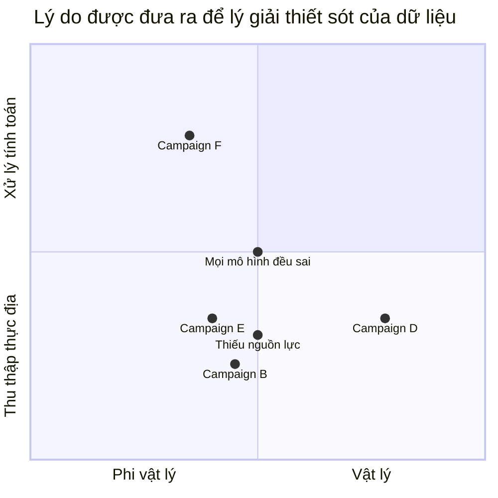

# Người làm dữ liệu nói gì về sự thiếu sót của dữ liệu?
Đa số chúng ta dùng các con số để đánh giá. Giáo viên chấm điểm học sinh, quản lý dùng kpi để xét lương. Cả người chấm điểm lẫn người bị chấm đều có cảm  giác đâu đó rằng các con số này không thể hiện hết thực tế
Nhwngz nhà nghiên cứu xã hội  làm rõ các cảm giác này hơnBài viết [The Limits of Data](https://issues.org/limits-of-data-nguyen/):
[Huyền thoại về dữ liệu khách quan](https://tiasang.com.vn/huyen-thoai-ve-du-lieu-khach-quan-5036912.html)
- Không nắm bắt được những thứ khó đo lường
- Dữ liệu định tính sẽ bị loại bỏ khi tổng hợp
- Hệ thống phân loại cứng nhắc, kém bao hàm
- Thiên kiến hệ thống ảnh hưởng đến cách chọn mẫu
- Quá tập trung vào một chỉ số

Lập luận người thép. Hãy cùng xem xét coi 

> Nếu bạn hành hạ dữ liệu đủ lâu, nó sẽ thú nhận tất cả
> — Ronald H. Coase
## Làm rõ câu hỏi
Vấn đề về tính đáng tin của dữ liệu và kết quả phân tích, không phải các vấn đề khác như tính riêng tư, tính sở hữu, tính pháp lý, tính lưu trữ của dữ liệu.

Đầu tiên, bài viết tập trung vào những **dữ liệu định lượng**, không phải dữ liệu định tính, không phải hệ thống dữ liệu

Giả định rằng người làm dữ liệu thành thật, không cố tình chế dữ liệu
Câu hỏi là nói về dữ liệu, không phải thông tin. 
Sẽ chỉ xét vê 
Nên sẽ không xét hệ thống dữ liệu

Mỗi background khác nhau sẽ cho một thái độ khác nhau
Có những cách yêu cầu khác nhau, thao tác khác nhau

Tại sao câu hỏi này đáng quan tâm? Nếu câu hỏi chỉ là "Dữ liệu thiếu sót thế nào", thì với một tiếp cận sẽ có câu trả lời hoàn hảo cho tiếp cận đó. Đã có vô vàn bài viết về nó. Nhưng theo tôi quan sát thì nó chưa đi được xa. 
Nhìn thấy thiếu sót của họ thì dễ, mô tả được thiếu sót đó bằng ngôn ngữ của họ mới là hay hơn. 
Điều gì khiến nó vô hình, không nằm trong mối quan tâm của họ, dù khi được chỉ ra thì cũng gật gù đồng ý
Điều này có thể diễn giải là sẽ bỏ sót, hoặc có thể diễn giải là điều đó không quan trọng. 
Việc ép ta phải khảo sát người làm dữ liệu sẽ giúp ta khám phá được thêm các tiếp cận khác 

Thiếu sót ở đây là các thiếu sót được chỉ ra trong bài viết

Phân loại luôn mang tính xác suất, 

Vấn đề về Tĩnh động trở thành vấn đề về local

Đến với dữ liệu để giải quyết công việc kinh doanh

Chỉ xét xem dữ liệu có đáng tin hay không, không xét đến tính quyền lực của nó 

Bản thân việc xác lập quần thể đã mang tính phân loại rồi

### Một số chủ đề hữu ích khi biết trước
Để tránh 

# Lịch sử các lĩnh vực 
# Các khái niệm trong thống kê
Dữ liệu didnhj lượng phải là trên tập số thực. Mình không nhất thiết phải dùng R, mà có thể dùng bất cứ đại số sigma nào. Phép đo như vậy có còn tính là định lượng nữa ko?

Dữ liệu là để kiểm định giả thiết
[Cần nghĩ về công việc như là một cách để kiểm định giả thiết, chứ không phải chỉ để hoàn thành](../../../Qu%E1%BA%A3n%20l%C3%BD%20d%E1%BB%B1%20%C3%A1n,%20ph%C3%A1t%20tri%E1%BB%83n%20s%E1%BA%A3n%20ph%E1%BA%A9m,%20x%C3%A2y%20d%E1%BB%B1ng%20t%E1%BB%95%20ch%E1%BB%A9c/C%C3%B4ng%20vi%E1%BB%87c/C%E1%BA%A7n%20ngh%C4%A9%20v%E1%BB%81%20c%C3%B4ng%20vi%E1%BB%87c%20nh%C6%B0%20l%C3%A0%20m%E1%BB%99t%20c%C3%A1ch%20%C4%91%E1%BB%83%20ki%E1%BB%83m%20%C4%91%E1%BB%8Bnh%20gi%E1%BA%A3%20thi%E1%BA%BFt,%20ch%E1%BB%A9%20kh%C3%B4ng%20ph%E1%BA%A3i%20ch%E1%BB%89%20%C4%91%E1%BB%83%20ho%C3%A0n%20th%C3%A0nh.md)

Biến ε không bao hàm các biến không được nghĩ tới 
# Quan điểm của ngành nhân văn về dữ liệu, và phản hồi của các ngành về quan điểm đó
# Các giả định được sử dụng

# Về bài này
Câu hỏi này ban đầu được bạn Bùi Hồng Quân đặt ra và đưa bài

bản thân bài này cũng có thể trở thành một nghiên cứu xã hội học. 

Nhai đi nhai lại, mỗi lần có một thứ gì đó mới

Thật không dễ để trả lời câu hỏi này, vì:
- Dù có nghiên cứu tới đâu, thì tôi cũng không có trải nghiệm trực tiếp

Có cố gắng tìm phản biện, nhưng cũng không muốn dành quá nhiều thời gian. Nên khi thấy có câu trả lời hợp lý là dừng
# Lý do viết bài
Thỏa trí tò mò
Thúc đẩy các dự án cộng đồng

## Phần 1: Ai là "người làm dữ liệu"?

Với phân tích trên, ta có thể chia thành những loại người được xem là "người làm dữ liệu" sau:
Phân theo công việc:
- Người thu thập dữ liệu thực địa
- Người làm thống kê
- Người làm máy học

Phân theo mục đích sử dụng:
- Nghiên cứu
- Quản lý và ra quyết định
- Dự đoán

Phân theo lĩnh vực:
- Khoa học xã hội
- Khoa học tự nhiên
- Triết học

Phân theo loại dữ liệu:
- Có thể lập mô hình tính toán
- Không thể lập mô hình tính toán

Phân theo thang đo:
- Danh nghĩa
- Thứ bậc
- Khoảng
- Tỉ lệ

[Phân biệt các loại thang đo trong nghiên cứu - Hệ thống thông tin Thống kê KH&amp;CN](https://thongke.cesti.gov.vn/dich-vu-thong-ke/tai-lieu-phan-tich-thong-ke/720-phan-biet-thang-do-trong-nghien-cuu)

Phân loại là thế, nhưng vì nó là sự phản hồi, phê bình giữa các ngành, nên 
khi tìm kiếm trên Google với từ khóa dữ liệu thì chủ yếu chỉ dành cho kinh doanh. Trong khi dữ liệu 
### Người thu thập dữ liệu thực địa nói gì về thiếu sót của dữ liệu?
Vấn đề nằm ở nguồn lực để đảm bảo động lực của đáp viên và nhân viên khảo sát không làm ảnh hưởng đến chất lượng dữ liệu.
- Không có mẫu đa dạng
- Đáp viên làm cho có
- Nhân viên khảo sát chỉ làm cho xong việc

Không lấy được dữ liệu không chính thức
lướt lẹ, thấy đáp viên lưỡng lự, thắc mắc về sự cứng nhắc của khảo sát thì chọn giùm cho đáp viên luôn

Do đã đặt hàng rồi, phải đáp ứng. Đáp viên thực sự không chịu làm, tới có khi còn bị đuổi ra
Hầu như việc chọn mẫu không đạt được tính đại diện
[Phần 2 - YouTube](https://youtu.be/BLadKzSGa5k?si=5TNXX5qyN6OWh23Q&t=913)

Form lấy mẫu cứng nhắc, không thế nào lường trước được. Triết học sự tĩnh. Nhưng như vậy mới tránh việc nhập nhầm, nhập sai

### Người làm thống kê nói gì về thiếu sót của dữ liệu?
Người làm phân tích dữ liệu có lẽ chỉ nghĩ đến việc lấy mẫu, độ tin cậy. Làm sạch, biến đổi, thu gọn dữ liệu. Nếu mọi thứ làm đúng thì dữ liệu là đáng tin
Vấn đề, nếu có, nằm ở lấy mẫu và kỹ thuật phân tích. 
Có lẽ cũng thường xuyên tự hỏi là hàm quy hồi này có đúng không. Nhưng dự đoán có sai số thấp quá rồi thì tin thôi
ngưỡng cắt

excel 
kiểm soát viên
Thống kê bắt đầu bằng việc có các điểm trong không gian, chứ không nói các điểm đó từ đâu ra. [Unit of observation](https://en.wikipedia.org/wiki/Unit_of_observation#Data_point). Nếu người thu thập dữ liệu tại thực địa không phản ánh 

[Statistical assumption](https://en.wikipedia.org/wiki/Statistical_assumption)
[Statistical model](https://en.wikipedia.org/wiki/Statistical_model)

Đặt tên các nhân tố mới bằng các khái niệm vừa tạo cảm giác ảo diệu, kiểu gì cũng sai, vừa tạo cảm giác khái niệm chỉ là phù du, dùng gì cũng đúng PCA 

Không bàn gì về việc lấy mẫu có vấn đề, không đặt câu hỏi về tên gọi của các biến đầu vào 

Bác bỏ hoặc không bác bỏ H₀. Nhưng không bác bỏ thì khác gì chấp nhận?

Dữ liệu định lượng cần dữ liệu định tính để diễn giải. Đó là vì công thức toán học là cách biểu diễn của 

### Người làm máy học nói gì về thiếu sót của dữ liệu?
Vấn đề nằm ở tham số

|                   | Phi vật lý           | Vật lý               |
| ----------------- | -------------------- | -------------------- |
| Thu thập thực địa | `Không đủ nguồn lực` | `Không đủ nguồn lực` |
| Xử lý tính toán   |                      |                      |

[Ngành khoa học dữ liệu còn nhiều thuật ngữ không có sự ổn định về nghĩa](../../../C%C3%B4ng%20ngh%E1%BB%87%20th%C3%B4ng%20tin/D%E1%BB%AF%20li%E1%BB%87u,%20AI/Khoa%20h%E1%BB%8Dc%20d%E1%BB%AF%20li%E1%BB%87u/Ng%C3%A0nh%20khoa%20h%E1%BB%8Dc%20d%E1%BB%AF%20li%E1%BB%87u%20c%C3%B2n%20nhi%E1%BB%81u%20thu%E1%BA%ADt%20ng%E1%BB%AF%20kh%C3%B4ng%20c%C3%B3%20s%E1%BB%B1%20%E1%BB%95n%20%C4%91%E1%BB%8Bnh%20v%E1%BB%81%20ngh%C4%A9a.md). Thậm chí có người còn cho rằng [cái gọi là khoa học dữ liệu đúng ra chỉ là kỹ thuật dữ liệu](../../../C%C3%B4ng%20ngh%E1%BB%87%20th%C3%B4ng%20tin/D%E1%BB%AF%20li%E1%BB%87u,%20AI/Khoa%20h%E1%BB%8Dc%20d%E1%BB%AF%20li%E1%BB%87u/C%C3%A1i%20g%E1%BB%8Di%20l%C3%A0%20khoa%20h%E1%BB%8Dc%20d%E1%BB%AF%20li%E1%BB%87u%20%C4%91%C3%BAng%20ra%20ch%E1%BB%89%20l%C3%A0%20k%E1%BB%B9%20thu%E1%BA%ADt%20d%E1%BB%AF%20li%E1%BB%87u.md). (Giống như không có khoa học phần mềm mà chỉ có kỹ thuật phần mềm.) Cho nên không có một loại người làm dữ liệu duy nhất để bàn về quan điểm của họ, mà phải biết là mình đang nói về loại người làm dữ liệu nào. Và loại người làm dữ liệu nào phụ thuộc vào bài toán dữ liệu nào họ thường giải quyết. Mỗi loại bài toán sẽ có nguồn gốc dữ liệu và cách sử dụng chúng khác nhau, dẫn đến cách tư duy khi giải quyết chúng cũng khác nhau.

Phân tích thống kê truyền thống tiếp tục _phương pháp suy diễn_ khi tìm kiếm mối quan hệ trong bộ dữ liệu. Trí tuệ nhân tạo, như hệ chuyên gia, và các kỹ thuật học máy tiếp tục dùng quy nạp để phát hiện các khuôn mẫu về mối quan hệ trong bộ dữ liệu. Lập luận suy diễn là quá trình như Aristotle về phân tích dữ liệu chi tiết, tính số đo, và tạo nên kết luận dựa trên kiến thức toán học về độ đo. Quy nạp là quá trình như Plato về sử dụng thông tin trong bộ dữ liệu tạo nên kết luận tổng quát, dù không hoàn toàn trực tiếp chứa các dữ liệu đầu vào. Phương pháp khoa học theo tiếp cận quy nạp, nhưng có nhiều yếu tố như tiếp cận Aristotle trong những bước thực hiện đầu.

### Quản lý và ra quyết định
❓thường chỉ dùng các phân tích độ tập trung, không phải độ phân tán của dữ liệu, không sử dụng thống kê, Ít nhất là thống kê mô tả
Không lập các sơ đồ mối quan hệ giữa các biến số (khung khái niệm)
[Nếu độ phân tán của dữ liệu là lớn, thì tính đại diện của các chỉ số tập trung là thấp](N%E1%BA%BFu%20%C4%91%E1%BB%99%20ph%C3%A2n%20t%C3%A1n%20c%E1%BB%A7a%20d%E1%BB%AF%20li%E1%BB%87u%20l%C3%A0%20l%E1%BB%9Bn,%20th%C3%AC%20t%C3%ADnh%20%C4%91%E1%BA%A1i%20di%E1%BB%87n%20c%E1%BB%A7a%20c%C3%A1c%20ch%E1%BB%89%20s%E1%BB%91%20t%E1%BA%ADp%20trung%20l%C3%A0%20th%E1%BA%A5p.md)
không đọc phần hạn chế nghiên cứu
sự khó chịu khi thấy người khác sử dụng kết quả của mình mà không hiểu về phương pháp
[Thước đo, đo lường, chỉ số, KPI](../../../%CE%9E%20Kh%C3%A1i%20ni%E1%BB%87m/Ph%C3%A1t%20tri%E1%BB%83n%20s%E1%BA%A3n%20ph%E1%BA%A9m,%20l%C3%AAn%20k%E1%BA%BF%20ho%E1%BA%A1ch,%20c%C3%B4ng%20vi%E1%BB%87c/Th%C6%B0%E1%BB%9Bc%20%C4%91o,%20%C4%91o%20l%C6%B0%E1%BB%9Dng,%20ch%E1%BB%89%20s%E1%BB%91,%20KPI.md)
## Phần 2: Dữ liệu có nguồn gốc từ đâu?
Tôi cho rằng dữ liệu có hai loại nguồn gốc. **Loại dữ liệu thứ nhất đến từ sự định lượng của con người về một khái niệm.** VD: bao nhiêu người là nam, bao nhiêu vị thần linh, bao nhiêu lượt truy cập web, v.v. Những khái niệm này vốn đã mang tính phân loại, và có nhiều cách để định nghĩa. Các định nghĩa này dù na ná nhau nhưng độc lập với nhau, không thể quy đổi được. Giả sử bạn có 2 định nghĩa có thể đo lường được về khái niệm "nam", và đã thống kê được bao nhiêu người là nam theo định nghĩa 1. Nhưng nếu sau đó muốn biết bao nhiêu người là nam theo định nghĩa 2, thì bạn phải thống kê lại từ đầu chứ không chuyển đổi đơn vị được. Không có chuyện quy đổi 1 nam theo định nghĩa 1 bằng bao nhiêu nam theo định nghĩa 2.

**Loại dữ liệu thứ hai đến từ sự đo lường các đại lượng vật lý.** VD: dài bao nhiêu mét, nặng bao nhiêu ký, v.v. Tuy cũng có thể nói là chúng là sự định lượng của con người về các khái niệm, nhưng dữ liệu chúng tạo ra sẽ luôn có đơn vị là tổ hợp của 7 đơn vị cơ bản sau:

<iframe width="560" height="315" src="https://www.youtube.com/embed/O8oZFaaJTUc?si=NXVvChgEGOhrvuVj" title="YouTube video player" frameborder="0" allow="accelerometer; autoplay; clipboard-write; encrypted-media; gyroscope; picture-in-picture; web-share" referrerpolicy="strict-origin-when-cross-origin" allowfullscreen></iframe>

Các đơn vị này được định nghĩa thông qua các **hằng số vũ trụ**. Ví dụ, 1 mét được định nghĩa là 1/299792458 quãng đường ánh sáng đi được trong 1 giây, còn 1 giây được định nghĩa là 9192631770 lần khoảng thời gian nguyên tử cesium-133 dao động giữa hai mức năng lượng. Đã gọi là hằng số vũ trụ nghĩa là *100%* chúng giống nhau ở bất kỳ nơi nào trên vũ trụ, chứ đừng nói là chỉ mỗi trên Trái đất. Thế nên ta luôn có thể đảm bảo là bất kỳ nền văn hóa nào cũng sẽ đưa ra được định nghĩa như thế, kể cả văn hóa của người ngoài hành tinh. 

Loài người có đưa ra nhiều định nghĩa khác nhau về các đại lượng, ví dụ như ở độ dài thì có mét, gang chân (foot), hải lý, v.v. Nhưng chúng có thể quy đổi được cho nhau. Ví dụ như 1 gang chân = 0.3048 m. Ta không cần phải đo lại từ đầu nếu muốn dùng định nghĩa độ dài này trong khi dữ liệu dùng định nghĩa độ dài kia. Còn nếu sử dụng một đơn vị đo chưa được quy chuẩn (VD: gang tay), thì đây là loại dữ liệu thứ nhất. Nhưng cũng có thể lập luận đây vẫn là loại dữ liệu thứ hai, chỉ có điều dụng cụ đo có sai số lớn mà thôi.

Nếu ta chấp nhận được sai số lớn thì có thể dùng các dụng cụ đo thô sơ. Nếu muốn sai số thấp hơn thì cần dùng các cảm biến, vốn hoạt động bằng việc đo một tần số năng lượng nào đó. Chúng giống như các radio mini, nếu dò trúng đài (gặp đúng tần số) thì chúng báo tín hiệu. Các thí nghiệm (nhất là với các thí nghiệm lớn) giống như việc dò vài trăm ngàn cái đài cùng lúc. 

Hình ảnh bên trong các trung tâm quan sát neutrino ở Nhật Bản.

Định lý giới hạn trung tâm khiến cho phân bố chuẩn Trong khi [Mô hình Gauss thường được dùng trong thực nghiệm vì nó có entropy cao nhất khi chỉ dựa vào μ và σ](M%C3%B4%20h%C3%ACnh%20Gauss%20th%C6%B0%E1%BB%9Dng%20%C4%91%C6%B0%E1%BB%A3c%20d%C3%B9ng%20trong%20th%E1%BB%B1c%20nghi%E1%BB%87m%20v%C3%AC%20n%C3%B3%20c%C3%B3%20entropy%20cao%20nh%E1%BA%A5t%20khi%20ch%E1%BB%89%20d%E1%BB%B1a%20v%C3%A0o%20%CE%BC%20v%C3%A0%20%CF%83.md)

Vấn đề không hẳn là có nhóm chứng hay không, mà là có ngẫu nhiên hay không 

vấn đề của comte bây giờ được hiểu là chọn loại kiểm định phù hợp. Việc lựa chọn kiểm định nào vẫn tùy thuộc vào đặc điểm của đối tượng nghiên cứu. Ngay cả bây giờ cũng cảm thấy dội
Sự không để ý và chất vấn cách dữ liệu đầu vào được phân loại thế nào là phổ biến

[Nếu không có phân loại, sẽ không có hành động](../../B%E1%BA%A3n%20th%E1%BB%83%20lu%E1%BA%ADn/Ph%C3%A2n%20lo%E1%BA%A1i/N%E1%BA%BFu%20kh%C3%B4ng%20c%C3%B3%20ph%C3%A2n%20lo%E1%BA%A1i,%20s%E1%BA%BD%20kh%C3%B4ng%20c%C3%B3%20h%C3%A0nh%20%C4%91%E1%BB%99ng.md)

Kể cả khi bộ câu hỏi đó đã được chuẩn hóa, validate

## Dữ liệu được xử lý thế nào?
Dù là loại dữ liệu nào thì cũng được dùng để lập hoặc kiểm tra giả thuyết. [Việc kiểm định giả thuyết thường bị bỏ qua khi có quá nhiều việc](../../../Qu%E1%BA%A3n%20l%C3%BD%20d%E1%BB%B1%20%C3%A1n,%20ph%C3%A1t%20tri%E1%BB%83n%20s%E1%BA%A3n%20ph%E1%BA%A9m,%20x%C3%A2y%20d%E1%BB%B1ng%20t%E1%BB%95%20ch%E1%BB%A9c/Ph%C3%A1t%20tri%E1%BB%83n%20s%E1%BA%A3n%20ph%E1%BA%A9m/Ki%E1%BB%83m%20%C4%91%E1%BB%8Bnh%20gi%E1%BA%A3%20thuy%E1%BA%BFt/Vi%E1%BB%87c%20ki%E1%BB%83m%20%C4%91%E1%BB%8Bnh%20gi%E1%BA%A3%20thuy%E1%BA%BFt%20th%C6%B0%E1%BB%9Dng%20b%E1%BB%8B%20b%E1%BB%8F%20qua%20khi%20c%C3%B3%20qu%C3%A1%20nhi%E1%BB%81u%20vi%E1%BB%87c.md) Nhưng với dữ liệu loại 1, mối quan hệ giữa các đại lượng chưa thể biểu diễn bằng biểu thức toán học được. Giả sử ta đã có một định nghĩa vô cùng chặt chẽ về khái niệm "nam" và "thần linh" (các khái niệm này được định nghĩa qua các hằng số vũ trụ :-?), thì làm sao để biết được mối quan hệ giữa độ nam tính và độ thần linh tính của một vật? Làm sao để viết được biểu thức $nam=f(thần linh)$ một cách tường minh? Cho nên, **khi xử lý dữ liệu loại 1, người ta chỉ sử dụng thống kê mô tả, vì mối quan hệ giữa các đại lượng trong thống kê không mang tính nhân quả.** 

Còn với dữ liệu loại 2, ta có thể xây dựng biểu thức toán học giữa các đại lượng một cách tường minh. Ví dụ như $lực = khối lượng\times gia tốc$. Các biểu thức này giúp giải thích được tại sao cảm biến ở vị trí này lại cho ra con số này vào thời điểm này, và tiên đoán được các con số đó sẽ thay đổi ra sao nếu sắp xếp vị trí các cảm biến khác đi. Cho nên, **khi xử lý dữ liệu loại 2, người ta không chỉ sử dụng thống kê mà còn sử dụng đủ loại toán cao cấp.** Ví dụ như phương trình Schrödinger dùng số phức và vi phân, phương trình Einstein dùng tensor. Phát biểu `Vũ trụ của chúng ta là một vũ trụ có nhóm đối xứng SU(3)×SU(2)×U(1)` là một phát biểu sử dụng nhóm đối xứng, một khái niệm trong đại số trừu tượng, và nó phù hợp với dữ liệu hiện giờ. Và thực tế là các lý thuyết này có năng lực tiên đoán cao, làm tăng thêm niềm tin rằng toán học là ngôn ngữ của tự nhiên. 

Sự khác biệt về cách xử lý giữa dữ liệu loại 1 và loại 2 là sự khác biệt giữa khoa học dữ liệu và khoa học tính toán: [Khoa học dữ liệu tập trung vào mẫu hình, khoa học tính toán tập trung vào các mối quan hệ nhân quả](../../../C%C3%B4ng%20ngh%E1%BB%87%20th%C3%B4ng%20tin/D%E1%BB%AF%20li%E1%BB%87u,%20AI/Khoa%20h%E1%BB%8Dc%20d%E1%BB%AF%20li%E1%BB%87u/Khoa%20h%E1%BB%8Dc%20d%E1%BB%AF%20li%E1%BB%87u%20t%E1%BA%ADp%20trung%20v%C3%A0o%20m%E1%BA%ABu%20h%C3%ACnh,%20khoa%20h%E1%BB%8Dc%20t%C3%ADnh%20to%C3%A1n%20t%E1%BA%ADp%20trung%20v%C3%A0o%20c%C3%A1c%20m%E1%BB%91i%20quan%20h%E1%BB%87%20nh%C3%A2n%20qu%E1%BA%A3.md). Làm việc với mẫu hình thì chỉ làm việc được những thứ mà ta có dữ liệu, những chỗ không có dữ liệu thì chịu chết. Còn làm việc với các mối quan hệ nhân quả thì ta mới phân tích được toàn bộ các hành vi của hệ, dù ta có ta dữ liệu về các hành vi đó hay không. Ví dụ, trong một hệ gồm những người mua và người bán, thì thường ta chỉ thu thập dữ liệu cho các giao dịch thành công, bởi vì nó dễ thấy nhất. Nhưng bộ dữ liệu như vậy không cho ta biết khi nào thì giao dịch thất bại, huống chi là lý do vì sao nó thất bại. Một giao dịch thất bại có thể là vì người mua không đủ tiền, cửa hàng không có món họ cần, cửa hàng ở quá xa, cửa hàng chỉ nhận tiền mặt mà người mua thì chỉ có tiền tài khoản, v.v. Nếu xây dựng được mô phỏng thì ta có thể phân tích được các tình huống giao dịch thất bại. Tất nhiên, để xây dựng mô phỏng người ta phải sử dụng rất nhiều giả thiết. Nhưng đây chính là lúc bộ dữ liệu phát huy tác dụng: loại trừ các mô phỏng cho ra kết quả giao dịch thành công không đúng với dữ liệu. Giả sử như ta không đi thu thập dữ liệu lại lần nữa, thì bộ dữ liệu về những giao dịch thành công vẫn giúp ta dự đoán được những lúc chúng thất bại. Đây là điều mà việc phân tích mẫu hình không làm được.

Lưu ý rằng, trong vật lý cũng có vô số đại lượng phi vật lý: hành tinh, 
Con người không tư duy bằng số liên tục, mà bằng khái niệm và phân loại
## Cách tư duy của người làm dữ liệu khi nhìn vào thiếu sót của dữ liệu
Tóm lại, các ngành khác nhau sẽ có các tư duy về dữ liệu khác nhau. Các ngành khoa học xã hội thì có lẽ chỉ có dữ liệu loại 1. Các ngành khoa học tự nhiên có lẽ có cả loại 1 và loại 2, trong đó loại 2 chiếm tỉ lệ nhiều hơn.

### Người làm các ngành khoa học xã hội nói gì về thiếu sót của dữ liệu?
Do cuộc đời của họ gắn chặt với dữ liệu loại 1 nên góc nhìn của họ về dữ liệu chỉ gồm những vấn đề của dữ liệu loại 1. Bài viết [The Limits of Data](https://issues.org/limits-of-data-nguyen/) chắc là tổng kết khá đầy đủ:
- Không nắm bắt được những thứ khó đo lường
- Dữ liệu định tính sẽ bị loại bỏ khi tổng hợp
- Hệ thống phân loại cứng nhắc, kém bao hàm
- Thiên kiến hệ thống ảnh hưởng đến cách chọn mẫu
- Quá tập trung vào một chỉ số

[Có những cách để hạn chế những vấn đề này](../../../../%F0%9F%93%9CT%C3%A0i%20nguy%C3%AAn/Gi%E1%BA%A3i%20ph%C3%A1p%20k%E1%BB%B9%20thu%E1%BA%ADt/H%E1%BB%8Dc%20t%E1%BA%ADp/Kh%E1%BA%AFc%20ph%E1%BB%A5c%20h%E1%BA%A1n%20ch%E1%BA%BF%20c%E1%BB%A7a%20d%E1%BB%AF%20li%E1%BB%87u%20%C4%91%E1%BB%8Bnh%20l%C6%B0%E1%BB%A3ng.md), nhưng có lẽ nếu họ làm được thì đã làm luôn rồi. Nhớ rằng, vì các khái niệm có nhiều cách để định nghĩa và không có cách nào để quy đổi dữ liệu dùng cho định nghĩa này sang định nghĩa kia, nên có lẽ sẽ vĩnh viễn không thể loại trừ được những vấn đề này, dù có ý thức đến mức độ nào đi chăng nữa. (Có lẽ trừ vấn đề cuối, do nó thiên về việc xây dựng chính sách, ra quyết định hơn.)

Một số ý hay khác trong bài:
- [Institutional quantification is designed to support procedures that can be executed by fungible employees](../../../Ngh%C4%A9%20v%E1%BB%81%20vi%E1%BB%87c%20ngh%C4%A9/Tri%E1%BA%BFt%20h%E1%BB%8Dc%20c%C3%B4ng%20ngh%E1%BB%87/%C4%90%E1%BB%8Bnh%20l%C6%B0%E1%BB%A3ng/Institutional%20quantification%20is%20designed%20to%20support%20procedures%20that%20can%20be%20executed%20by%20fungible%20employees.md)
- [The wider the user base for the data, the more decontextualized the data needs to be](../../../Ngh%C4%A9%20v%E1%BB%81%20vi%E1%BB%87c%20ngh%C4%A9/Tri%E1%BA%BFt%20h%E1%BB%8Dc%20c%C3%B4ng%20ngh%E1%BB%87/%C4%90%E1%BB%8Bnh%20l%C6%B0%E1%BB%A3ng/The%20wider%20the%20user%20base%20for%20the%20data,%20the%20more%20decontextualized%20the%20data%20needs%20to%20be.md)
- [Các hệ thống phân loại quyết định trước cái gì được nhớ và cái gì được quên](../../B%E1%BA%A3n%20th%E1%BB%83%20lu%E1%BA%ADn/Ph%C3%A2n%20lo%E1%BA%A1i/C%C3%A1c%20h%E1%BB%87%20th%E1%BB%91ng%20ph%C3%A2n%20lo%E1%BA%A1i%20quy%E1%BA%BFt%20%C4%91%E1%BB%8Bnh%20tr%C6%B0%E1%BB%9Bc%20c%C3%A1i%20g%C3%AC%20%C4%91%C6%B0%E1%BB%A3c%20nh%E1%BB%9B%20v%C3%A0%20c%C3%A1i%20g%C3%AC%20%C4%91%C6%B0%E1%BB%A3c%20qu%C3%AAn.md)
- [All classification systems are the result of political and social processes, which involve decisions about what’s worth remembering and what we can afford to forget](../../B%E1%BA%A3n%20th%E1%BB%83%20lu%E1%BA%ADn/Ph%C3%A2n%20lo%E1%BA%A1i/All%20classification%20systems%20are%20the%20result%20of%20political%20and%20social%20processes,%20which%20involve%20decisions%20about%20what%E2%80%99s%20worth%20remembering%20and%20what%20we%20can%20afford%20to%20forget.md)
- [Một hệ thống phân loại càng được nhiều người sử dụng thì càng khó thay đổi](../../B%E1%BA%A3n%20th%E1%BB%83%20lu%E1%BA%ADn/Ph%C3%A2n%20lo%E1%BA%A1i/M%E1%BB%99t%20h%E1%BB%87%20th%E1%BB%91ng%20ph%C3%A2n%20lo%E1%BA%A1i%20c%C3%A0ng%20%C4%91%C6%B0%E1%BB%A3c%20nhi%E1%BB%81u%20ng%C6%B0%E1%BB%9Di%20s%E1%BB%AD%20d%E1%BB%A5ng%20th%C3%AC%20c%C3%A0ng%20kh%C3%B3%20thay%20%C4%91%E1%BB%95i.md)
- [Sự định lượng là cách để ra quyết định mà trông không giống như quyết định](../../../Ngh%C4%A9%20v%E1%BB%81%20vi%E1%BB%87c%20ngh%C4%A9/Tri%E1%BA%BFt%20h%E1%BB%8Dc%20c%C3%B4ng%20ngh%E1%BB%87/%C4%90%E1%BB%8Bnh%20l%C6%B0%E1%BB%A3ng/S%E1%BB%B1%20%C4%91%E1%BB%8Bnh%20l%C6%B0%E1%BB%A3ng%20l%C3%A0%20c%C3%A1ch%20%C4%91%E1%BB%83%20ra%20quy%E1%BA%BFt%20%C4%91%E1%BB%8Bnh%20m%C3%A0%20tr%C3%B4ng%20kh%C3%B4ng%20gi%E1%BB%91ng%20nh%C6%B0%20quy%E1%BA%BFt%20%C4%91%E1%BB%8Bnh.md)

Tựu chung, sự chỉ trích về dữ liệu, một sự hoài nghi không hồi kết về tính đáng tin của dữ liệu
Quetelet xem sự khác biệt giữa các cá nhân là do sai số tác động đến khuôn mẫu. Galton xem sự khác biệt số đo là có thật chứ không phải là sai số
Quetelet và Galton 
Những nhà thống kê học sẽ sử dụng điểm nhìn từ triết học thống kê ([philosophy of statistics](https://en.wikipedia.org/wiki/Philosophy_of_statistics))
Diễn giải số liệu và mô hình. Mong muốn dùng dữ liệu để không gặp phải tình trạng không diễn giải, nhưng hóa ra là không thoát được
[Cứt bò cứt ngựa trong thời đại dữ liệu](../../../C%C3%B4ng%20ngh%E1%BB%87%20th%C3%B4ng%20tin/D%E1%BB%AF%20li%E1%BB%87u,%20AI/C%E1%BB%A9t%20b%C3%B2%20c%E1%BB%A9t%20ng%E1%BB%B1a%20trong%20th%E1%BB%9Di%20%C4%91%E1%BA%A1i%20d%E1%BB%AF%20li%E1%BB%87u.md)
Comte vật lý xã hội
[constructivism](https://en.wikipedia.org/wiki/Constructivism_(philosophy_of_science))
Cơ bản là toàn bộ việc nghiên cứu định lượng ([quantitative research](https://en.wikipedia.org/wiki/Quantitative_research)). Bàn nhiều hơn về những câu hỏi về nhận thức luận, bản thể luận như "thế nào là khách quan", hơn là những giới hạn thực hành 
và khoa học tự quy chiếu (metascience) sẽ 

[What make physical measurements enjoy advanced statistical model](https://philosophy.stackexchange.com/q/136966/19487)

[Trong nghiên cứu định tính, việc diễn giải câu trả lời có sự tham gia của người trả lời. Trong nghiên cứu định lượng, việc đó nằm ở người làm nghiên cứu](../Trong%20nghi%C3%AAn%20c%E1%BB%A9u%20%C4%91%E1%BB%8Bnh%20t%C3%ADnh,%20vi%E1%BB%87c%20di%E1%BB%85n%20gi%E1%BA%A3i%20c%C3%A2u%20tr%E1%BA%A3%20l%E1%BB%9Di%20c%C3%B3%20s%E1%BB%B1%20tham%20gia%20c%E1%BB%A7a%20ng%C6%B0%E1%BB%9Di%20tr%E1%BA%A3%20l%E1%BB%9Di.%20Trong%20nghi%C3%AAn%20c%E1%BB%A9u%20%C4%91%E1%BB%8Bnh%20l%C6%B0%E1%BB%A3ng,%20vi%E1%BB%87c%20%C4%91%C3%B3%20n%E1%BA%B1m%20%E1%BB%9F%20ng%C6%B0%E1%BB%9Di%20l%C3%A0m%20nghi%C3%AAn%20c%E1%BB%A9u.md)

Liệu có thể thiết kế một dạng thống kê mà việc không để ý đến mô hình cũng không phải là quá lớn?

với điểm cho sinh viên, thì việc cần là phân loại thành các nhóm này,  chứ không phải là phổ Gauss

Người đòi hỏi công bằng đòi hỏi minh bạch. Dữ liệu định lượng tạo ra cảm giác minh bạch rất tốt

Dư liệu để tạo  thành insight. Nhưng dưới tảng băng là câu chuyện con người. Đây mới là thứ tạo ra action và impact, không phải dữ liệu

Nếu người làm dữ liệu định tính cũng tương tác trực tiếp với khách thể, thì việc dữ liệu định lượng bị loại bỏ cũng bị giảm thiệt hại

từ 7 lên 8 khác với 8 lên 9
Điểm yếu của dữ liệu là sự tự ti, mặc cảm, cảm thấy bị cạnh tranh quyền lợi. Để vượt qua nó thì cần mình thực sự quan tâm đến người bị đánh giá
Làm sao để phụ huynh không so sánh điểm giữa các trường
### Cách nhìn của người làm các ngành khoa học tự nhiên về dữ liệu
Quan tâm về giá trị p, phân tích các nghiên cứu về nghiên cứu
Do cuộc đời của họ gắn chặt với dữ liệu loại 2 nên góc nhìn của họ về dữ liệu chỉ gồm những vấn đề của dữ liệu loại 2. Tức chỉ là phương pháp lấy dữ liệu. Nếu đúng phương pháp thì là dữ liệu tốt. Những vấn đề của dữ liệu loại 1 nếu có ở dữ liệu loại 2 thì cũng không quá nhiều, nên họ không thấy quan niệm `Tự bản thân việc lấy dữ liệu đã là có vấn đề` là cần thiết. Ngay cả khi họ làm việc trên dữ liệu loại 1 thì vẫn thấy rằng quan niệm [Mọi mô hình đều sai](../../../Ngh%C4%A9%20v%E1%BB%81%20vi%E1%BB%87c%20ngh%C4%A9/Hi%E1%BB%83u%20bi%E1%BA%BFt/M%E1%BB%8Di%20m%C3%B4%20h%C3%ACnh%20%C4%91%E1%BB%81u%20sai,%20nh%C6%B0ng%20m%E1%BB%99t%20s%E1%BB%91%20th%C3%AC%20h%E1%BB%AFu%20%C3%ADch.md) là đã đủ rồi. 

Trích Max Planck:
> Mỗi thí nghiệm là một câu hỏi mà khoa học đặt ra cho tự nhiên, và mỗi phép đo là sự ghi lại câu trả lời của tự nhiên

Nếu xem con số là câu trả lời của tự nhiên, và nếu xem tự nhiên thì không nói dối, thì đúng là `Các con số không biết nói dối` thật. Tất nhiên, họ cũng biết rằng một nửa sự thật thì không phải là sự thật, và rằng có thể có những điều mà không những các cảm biến không đo được, mà cả các mô hình tính toán cũng không chỉ ra được luôn. Giống như những hạt neutrino bay qua không để lại tương tác gì cả. Nhưng việc có những thứ không đo đạc được đó không làm họ đau khổ như những đồng nghiệp bên khoa học xã hội. Nó đúng là kiểu "out of sight, out of mind" mà những người kia sợ hãi. Nếu bằng lập luận họ chỉ ra được còn những thứ mà lần lấy dữ liệu lần trước còn thiếu sót thì họ đi đo lại thôi, không việc gì phải xoắn. Nếu bây giờ chưa đo được thì tương lai con cháu sau này sẽ đo được. Còn nếu nó mãi mãi không đo được thì chắc được gọi là triết học, tâm linh, hoặc lý thuyết dây.

Thậm chí, việc lược bỏ chi tiết để vấn đề là một thực hành có chủ ý
Con bò cầu
Mỗi chi tiết bị lược bỏ không phá hủy kết quả cũ, mà chỉ làm tăng độ chính xác 
pẻm
[Lý thuyết nhiễu loạn – Wikipedia tiếng Việt](https://vi.wikipedia.org/wiki/Lý_thuyết_nhiễu_loạn)

Tại sao các sách về thống kê, dữ liệu không bàn về điều này?
Đòi hỏi một nhánh toán học mô tả về sự phân loại. Có ngành category. Không biết có liên quan gì không

dãy thời gian
trung tâm khối lượng. Con bò cầu
Trung bình cộng là kỳ vọng khi các trọng số là ngang nhau. Khối tâm của vật, là tạo thành chất điểm. Đứng từ xa thì sự phân tán không quan trọng. 
#### Giả thiết về ảnh hưởng của ngành vật lý lên ngành dữ liệu
Ngay từ những ngày đầu hình thành, vật lý đã ảnh hưởng đến xã hội học.

Ngay từ những ngày đầu hình thành, vật lý đã ảnh hưởng đến khoa học máy tính. [Vật lý tính toán là ứng dụng đầu tiên của máy tính vào khoa học](https://hsm.stackexchange.com/a/19171/65). Những chiếc máy tính đầu tiên được phát triển những năm thế chiến 2, lúc nhu cầu tính toán đường đạn và phản ứng hạt nhân tăng cao.

) Cộng với việc khoa học tính toán ra đời sớm hơn và đòi hỏi những xử lý phức tạp hơn khoa học dữ liệu, nên có lẽ những người làm khoa học tự nhiên sẽ có lợi thế khi chuyển sang ngành dữ liệu. Nói cách khác, **có lẽ phần lớn nhân sự trong ngành này có tư duy phù hợp để làm dữ liệu loại 2.**

Có lẽ có thể nói là nhu cầu xây dựng lý thuyết mới về tính toán và thống kê gắn chặt với nhu cầu giải quyết bài toán của các ngành khoa học tự nhiên, đặc biệt là vật lý. (

Trong khi đó, ngành này thì lại chỉ xử lý dữ liệu loại 1 (vì dữ liệu loại 2 là ở ngành khoa học tính toán). Và vì cả hai loại dữ liệu đều được gọi chung là dữ liệu, nên những người làm khoa học tự nhiên sẽ không để ý thấy mình đang dùng tư duy sai lên bộ dữ liệu của mình, trừ phi làm trong ngành thật lâu. Nên có lẽ một phần việc người sử dụng dữ liệu không để ý đến vấn đề của dữ liệu là từ chuyện này. Có thể xem đây là một dạng lấy vật lý làm trung tâm. (Nó khác vật lý luận ở chỗ nó chỉ dùng tư duy vật lý trong việc xử lý dữ liệu, không phải là quan niệm xem mọi thứ đều giải thích được bằng vật lý).

[social physics](https://en.wikipedia.org/wiki/Social_physics)
tính toàn cầu 
## Các trường hợp đáng chú ý
### Các ngành khoa học tự nhiên thường làm dữ liệu loại 1, hoặc không thể đo lại được
Sinh học
Vật lý thiên văn không có phòng thí nghiệm
Lý thuyết MaxEnt 
Phân tích gene thì cũng dùng cảm biến, và có thể chứa thiên kiến 

### Tiền và kinh tế học
Tiền tuy không phải là đại lượng vật lý và là sự định lượng của con người về khái niệm, nhưng có vẻ nó vẫn mang các đặc điểm của dữ liệu loại 2 hơn là loại 1: 
- **Có thể chuyển đổi giữa các cách định nghĩa:** tuy có nhiều cách định nghĩa về [giá trị](https://en.wikipedia.org/wiki/Exchange_value), nhưng một khi nó đã là **vật trung gian** rồi thì tất cả mọi người đều phải đồng ý với nhau?
- **Các biểu thức tường minh giữa các khái niệm có thể thiết lập được:** các phương trình kế toán, kinh tế
- **Hệ kinh tế có thể mô phỏng được:** value flow, lý thuyết nhóm. Ngoài thống kê, toán tài chính, kinh tế cũng đóng góp những thứ khác vào toán. Ví dụ như số âm, số e.

Nếu chỉ thuần túy xem các giá trị của tiền biến đổi thế nào thì nó hoàn toàn là trò chơi toán học. Theo nghĩa đó thì các nhà tư bản chỉ cần dùng tư duy của dữ liệu loại 2 là được? Trục trặc chỉ xảy ra khi ta định lượng các khái niệm *khác*, như "rủi ro", "kỳ vọng", "năng suất", "thịnh vượng", "hạnh phúc", "phạm tội", v.v. Mà có lẽ các khái niệm này mới là thứ đáng để quan tâm hơn.

Có lẽ tiền là một ngoại lệ của cả loại 1 và loại 2. Hoặc nói cách khác nó là một điểm giao của 1 và 2?

Bản thân giá cả là một dạng định lượng giá trị. Nên mọi thứ tạo ra tiền cũng sẽ định lượng theo. Tức là dữ liệu

số tiền ngay từ đầu đã không cần tới sai số. Giả dụ 3 người ăn chung một bữa hết 100k thì khi chia tiền cũng sẽ có người chịu thiệt hơn một chút, chứ không ai mỗi người 
### Y học
Nghĩ là ngẫu nhiên nhưng hóa ra vẫn chưa phải
bác sĩ cũng chẳng có thời gian để đọc nghiên cứu, mà chỉ tham gia hội thảo tập huấn , xong 
Các hội chuyên ngành mâu thuẫn về thế nào là cao huyết áp
Kiến thức về xác suất lúc này vẫn là một dạng thực

Biến phân loạ
- Rất khó để lấy mẫu ngẫu nhiên: việc thí nghiệm được xem là vô đạo đức, kể cả khi có sự đồng thuận của khách thể. 
- Vừa mang tính khoa học tự nhiên (các chỉ số vật lý, sinh lý), vừa mang tính xã hội cao
- Có tiềm năng gây hại
- Nhân trắc học

Kết quả ở vật lý có tính không thời gian, nhưng ở y học thì không. 

Trò chơi số liệu. Tính không kỹ nên về xử lý theo hướng khác.
Mang tính chính trị

sai số hệ thống, nhưng có vẻ chỉ nói về hệ thống máy móc, quy trình, chứ không phải là hệ thống xã hội
cảnh giác với chiến lược chọn mẫu. Thiên kiến lọt ra ngoài các mù đơn, mù đôinhững thứ mang tính hệ thống thường là các ếu tố nhân khẩu học. Những yếu tố này cũng thường là yếu tố nhiễu (confounder)
lúc thiết kế nghiên cứu không làm kỹ, hướng dẫn không nhận ra, phản biện không nhìn thấy. Thì cũng là một phần tất yếu của việc làm khoa học
đủ sự đa dạng trong hội đồng

bằng chứng ca bệnh được xếp thấp nhất, trong khi việc điều trị thì lại ưu tiên cá nhân hóa. Phải trải qua

Kiểm định giống là một cái hộp đen, chỉ cần biết lúc nào cần xài, còn tại sao nó hoạt động thì không biết

[Các mô hình được mô tả bởi các tham số](./C%C3%A1c%20m%C3%B4%20h%C3%ACnh%20%C4%91%C6%B0%E1%BB%A3c%20m%C3%B4%20t%E1%BA%A3%20b%E1%BB%9Fi%20c%C3%A1c%20tham%20s%E1%BB%91.md)
[Anthropometry - Wikipedia](https://en.wikipedia.org/wiki/Anthropometry)

Khi giảng thì chỉ chủ yếu là tính cỡ mẫu, phương pháp lấy mẫu nói cho biết thôi. Không nói vì về thiên kiến hệ thống. Miễn là lấy ngẫu nhiên thì vấn đề do thiên kiến chỉ là do xui, với xác suất xui là dưới 5% hay gì đó, chứ không phải là do nhóm nghiên cứu chịu thiên kiến. 

Thế nên, tất cả những gì cần làm là đảm bảo việc lấy mẫu, chứ không cần quan tâm đến hiểu biết về thiên kiến hệ thống. Tất nhiên, không cần không có nghĩa là không nên; nếu nhóm nghiên cứu có sự quan tâm tới sự đa dạng thì cũng sẽ cảnh giác với nhóm mẫu vô tình bị thiếu đa dạng, và sẽ lấy bổ sung thêm. Nhưng đảm bảo được việc lấy mẫu ngẫu nhiên đã là điều rất tốt rồi. 
Thực tế sẽ kiểm chứng lý thuyết, nên miễn là tuân thủ đúng quy trình thì không phải sợ bản thân có thiên kiến và để thiên kiến đó ảnh hưởng lên kết quả

Suy nghĩ của những người trong ngành do tôi mường tượng ra từ việc lắng nghe. Trong một ngành có thể có nhiều ý kiến khác nhau

người thao tác với máy không nhất thiết phải hiểu. Bạn đứng lên cân cũng chẳng quan tâm xem độ nhạy, độ đặc hiệu

Sai số khi đo đạc vật lý là sai số toán học. Sai số khi lấy mẫu con người không là như thế 
Bởi vì khi đo đạc vấn đề sai số không phải là vấn đề gì cả, nên người làm thống kê có thể yên tâm
tự nhiên không trả lời cho có, cho xong

sự diễn giải chính là các tính chất dùng để trang bị cho vật thể toán học

mẫu ko chỉ phải cần lấy ngẫu nhiên, mà liệu phân bổ của mẫu cũng có cần phải ngẫu nhiên không? Ví dụ như những người trong tỉnh cũng phải được phân bố ngẫu nhiên, chứ không phải theo cụm? Vì cùng một tỉnh cũng có thành phố và núi

Mật độ dân cư không bằng phân bố mật độ dân cư

dân số chính xác đến từng người, ko hề nói sai số là bao nhiêu. Khi nhập vào máy không hề thấy cột sai số

Chúng ta có xu hướng quên mất những vấn đề đó. Nguyên lý đỉnh – cuối. 

Người làm dân số học, y tế công cộng dường như chỉ làm thống kê mô tả, không phải thống kê suy diễn. Ví dụ đánh giá sức khỏe ở Trà Vinh. Tất nhiên không thể lấy mẫu toàn bộ quần thể được, nên chắc chắn đây phải là thống kê suy diễn. Nhưng tất cả những thao tác họ làm đều chỉ là thống kê mô tả.  
## Xem thêm
- [Việc phân loại không quan trọng bằng việc chuẩn bị cho sự thay đổi cách phân loại](../../B%E1%BA%A3n%20th%E1%BB%83%20lu%E1%BA%ADn/Ph%C3%A2n%20lo%E1%BA%A1i/Vi%E1%BB%87c%20ph%C3%A2n%20lo%E1%BA%A1i%20kh%C3%B4ng%20quan%20tr%E1%BB%8Dng%20b%E1%BA%B1ng%20vi%E1%BB%87c%20chu%E1%BA%A9n%20b%E1%BB%8B%20cho%20s%E1%BB%B1%20thay%20%C4%91%E1%BB%95i%20c%C3%A1ch%20ph%C3%A2n%20lo%E1%BA%A1i.md)
- [Chỉ theo đuổi một chỉ số là quá đơn giản](../../../Qu%E1%BA%A3n%20l%C3%BD%20d%E1%BB%B1%20%C3%A1n,%20ph%C3%A1t%20tri%E1%BB%83n%20s%E1%BA%A3n%20ph%E1%BA%A9m,%20x%C3%A2y%20d%E1%BB%B1ng%20t%E1%BB%95%20ch%E1%BB%A9c/Ph%C3%A1t%20tri%E1%BB%83n%20s%E1%BA%A3n%20ph%E1%BA%A9m/Ch%E1%BB%89%20s%E1%BB%91/Ch%E1%BB%89%20theo%20%C4%91u%E1%BB%95i%20m%E1%BB%99t%20ch%E1%BB%89%20s%E1%BB%91%20l%C3%A0%20qu%C3%A1%20%C4%91%C6%A1n%20gi%E1%BA%A3n.md). [Sự đơn giản ép ta phải làm nó cực kỳ tốt](../../../Qu%E1%BA%A3n%20l%C3%BD%20d%E1%BB%B1%20%C3%A1n,%20ph%C3%A1t%20tri%E1%BB%83n%20s%E1%BA%A3n%20ph%E1%BA%A9m,%20x%C3%A2y%20d%E1%BB%B1ng%20t%E1%BB%95%20ch%E1%BB%A9c/Th%C3%A0nh%20l%E1%BA%ADp%20d%E1%BB%B1%20%C3%A1n/Startup/S%E1%BB%B1%20%C4%91%C6%A1n%20gi%E1%BA%A3n%20%C3%A9p%20ta%20ph%E1%BA%A3i%20l%C3%A0m%20n%C3%B3%20c%E1%BB%B1c%20k%E1%BB%B3%20t%E1%BB%91t.md)
- [Việc phân loại không quan trọng bằng việc chuẩn bị cho sự thay đổi cách phân loại](../../B%E1%BA%A3n%20th%E1%BB%83%20lu%E1%BA%ADn/Ph%C3%A2n%20lo%E1%BA%A1i/Vi%E1%BB%87c%20ph%C3%A2n%20lo%E1%BA%A1i%20kh%C3%B4ng%20quan%20tr%E1%BB%8Dng%20b%E1%BA%B1ng%20vi%E1%BB%87c%20chu%E1%BA%A9n%20b%E1%BB%8B%20cho%20s%E1%BB%B1%20thay%20%C4%91%E1%BB%95i%20c%C3%A1ch%20ph%C3%A2n%20lo%E1%BA%A1i.md)
- [Cứt bò cứt ngựa trong thời đại dữ liệu](../../../C%C3%B4ng%20ngh%E1%BB%87%20th%C3%B4ng%20tin/D%E1%BB%AF%20li%E1%BB%87u,%20AI/C%E1%BB%A9t%20b%C3%B2%20c%E1%BB%A9t%20ng%E1%BB%B1a%20trong%20th%E1%BB%9Di%20%C4%91%E1%BA%A1i%20d%E1%BB%AF%20li%E1%BB%87u.md)

Khái niệm:: [Dữ liệu](../../../%CE%9E%20Kh%C3%A1i%20ni%E1%BB%87m/D%E1%BB%AF%20li%E1%BB%87u.md), [Mô hình](../../../%CE%9E%20Kh%C3%A1i%20ni%E1%BB%87m/M%C3%B4%20h%C3%ACnh.md), [Phân loại](../../../%CE%9E%20Kh%C3%A1i%20ni%E1%BB%87m/Nh%E1%BA%ADn%20th%E1%BB%A9c/Ph%C3%A2n%20lo%E1%BA%A1i.md), [Khảo sát](../../../%CE%9E%20Kh%C3%A1i%20ni%E1%BB%87m/Kh%E1%BA%A3o%20s%C3%A1t.md)

Kết quả sẽ được dùng để xây dựng chính sách

[Time series - Wikipedia](https://en.wikipedia.org/wiki/Time_series)

[Checking your browser...](https://caphesach.wordpress.com/2025/10/05/thong-ke-mo-ta-va-thong-ke-suy-luan-phan-i/)

[Computation in Physical Systems (Stanford Encyclopedia of Philosophy)](https://plato.stanford.edu/entries/computation-physicalsystems/)

  

Nếu không nói gì thêm thì mặc định là dữ liệu định lượng

Quản lý con người

Mường tượng nếu bản thân là, tôi sẽ

Theo quan sát của tôi khi xem một số cuộc nói chuyện của những người nghiên cứu về triết học dữ liệu, họ ít tập trung vào việc chỉ ra dữ liệu có thể tạo ra thiếu sót thế nào, mà tập trung vào những câu hỏi như "dữ liệu đã được thần tượng như thế nào", hay "sự thần tượng dữ liệu đã làm cho các nghiên cứu phê bình dữ liệu gặp khó khăn trong việc xin quỹ hoặc công bố thế nào", hoặc "các sáng kiến dữ liệu mở có những hạn chế tự thân nào", "đạo đức sử dụng dữ liệu

  

không nói gì về sự phân loại

Dù dữ liệu định lượng được tìm đến như là giải pháp để giải quyết thiên kiến, nó vẫn có nhiều cách để diễn giải, và có nhiều cách để diễn giải sai. Ngay cả dữ liệu định lượng cũng đòi hỏi có dữ liệu định tính để có diễn giải phù hợp

Người làm nghiên cứu nếu muốn dễ kiếm quỹ thường phải bỏ qua việc phê phán phương pháp lấy dữ liệu làm trung tâm

Những chỉ trích chỉ có tác dụng với các nghiên cứu cũ. Khi quá trình bình duyệt được cập nhật rồi thì cũng không phải lo là nghiên cứu bị như vậy. Nhưng cũng có thể đặt vấn đề là liệu sự bình duyệt, phản biện có đủ không? Việc khám phá thiên kiến do sự phân loại cũng giống như việc khám phá ra placebo vậy

[Sự phân loại không quan tâm tới quần thể, phương pháp nghiên cứu](../S%E1%BB%B1%20ph%C3%A2n%20lo%E1%BA%A1i%20kh%C3%B4ng%20quan%20t%C3%A2m%20t%E1%BB%9Bi%20qu%E1%BA%A7n%20th%E1%BB%83,%20ph%C6%B0%C6%A1ng%20ph%C3%A1p%20nghi%C3%AAn%20c%E1%BB%A9u.md)

Dữ liệu mở 

[https://youtube.com/watch?v=VfEutWbyNZ0&si=PDgNcTuD0rA0Xtfn](https://youtube.com/watch?v=VfEutWbyNZ0&si=PDgNcTuD0rA0Xtfn)

Phải biết Người làm Dữ liệu là ai, hằng ngày họ nghĩ gì về dữ liệu, làm với dữ liệu gì, thì mới biết họ nghĩ gì về dữ liệu

Chỉ xét khi có một tập các điểm, chứ không nói xem các điểm này đến từ đâu
THỉnh thoảng vẫn rộ lên một vụ rút bài 

Nếu không thể đảm bảo quá trình lấy mẫu là ngẫu nhiên thì nên mạnh dạn thừa nhận là tất cả những gì mình có thể làm là thống kê mô tả

[Mặc dù yếu tố con người luôn ảnh hưởng đến quá trình thu thập dữ liệu, nhưng mong muốn loại bỏ nó ra khỏi dữ liệu để tăng cường tính khách quan vẫn rất mạnh mẽ](../../../Ngh%C4%A9%20v%E1%BB%81%20vi%E1%BB%87c%20ngh%C4%A9/Tri%E1%BA%BFt%20h%E1%BB%8Dc%20c%C3%B4ng%20ngh%E1%BB%87/M%E1%BA%B7c%20d%C3%B9%20y%E1%BA%BFu%20t%E1%BB%91%20con%20ng%C6%B0%E1%BB%9Di%20lu%C3%B4n%20%E1%BA%A3nh%20h%C6%B0%E1%BB%9Fng%20%C4%91%E1%BA%BFn%20qu%C3%A1%20tr%C3%ACnh%20thu%20th%E1%BA%ADp%20d%E1%BB%AF%20li%E1%BB%87u,%20nh%C6%B0ng%20mong%20mu%E1%BB%91n%20lo%E1%BA%A1i%20b%E1%BB%8F%20n%C3%B3%20ra%20kh%E1%BB%8Fi%20d%E1%BB%AF%20li%E1%BB%87u%20%C4%91%E1%BB%83%20t%C4%83ng%20c%C6%B0%E1%BB%9Dng%20t%C3%ADnh%20kh%C3%A1ch%20quan%20v%E1%BA%ABn%20r%E1%BA%A5t%20m%E1%BA%A1nh%20m%E1%BA%BD.md)
Phương pháp đánh giá phải đồng nhất. Nếu là máy cơ thì phải là máy cơ hết. Nếu là máy điện tử thì phải là máy điện tử hết. [Chuyên đề 5: Các chỉ số đánh giá Dân số - YouTube](https://youtu.be/N5dsReAW_T0?si=Pbo8TLMbA9rX_qMD&t=1137)

một phép đo có thể đánh giá một cách chính xác, đúng đắn, trung thực với bản chất được hay không? 

Đo lường một khái niệm khác với thống kê một quần thể
Ghi số huyết áp vào sổ thì không ghi loại máy đo, sai số của máy
tổng điều tra dân số là lấy mẫu toàn bộ quần thể

Vấn đề không còn là có chính xác không, mà là còn đáng để sử dụng hay không. Không chính xác, nhưng giá trị vẫn có đó thì thà vẫn dùng còn hơn ko dùng

### Trung bình
trung bình chính là lấy sự điển hình trong sự phân loại. Nó dùng để ta kỳ vọng, để ra quyết định. Nhưng có lẽ chỉ phù hợp nếu phân bố tập trung quanh trung bình 
Trung bình bảo toàn tuyến tính. Z + X1+X2 => E(Z) = E(X1) + E(X2)

Thống kê suy diễn dựa vào một nguyên lý duy nhất, đó là mẫu phải được lấy ngẫu nhiên. Tức là nếu ta có những biện giải để nói rằng lấy mẫu không ngẫu nhiên là có lợi, thì nó không giải thích được. Lấy mẫu khai thác . Mô hình thống kê mới. Theo logic này này thì không phải là do không lấy mẫu được ngẫu nhiên, mà là chưa cập nhật mô hình mới.
Nghĩa là lúc này giới hạn của dữ liệu trở thành giới hạn của giáo dục thống kê (nếu đã có mô hình phù hợp cho cách lấy mẫu), hoặc giới hạn của nghiên cứu thống kê (nếu chưa ai xây dựng được mô hình phù hợp). Thường nghiên cứu phải nhiều tiền thì mới có một nhà thống kê trong nhóm nghiên cứu

độ lệch so với trung bình. Tôi có nhận thấy độ lệch này thường được gọi là độ lệch chuẩn, nhưng do đang đứng ở góc độ phê bình chuẩn nên có lẽ nên gọi bằng cách khác.

định lý giới hạn trung tâm đòi hỏi các biến ngẫu nhiên phải độc lập với nhau, tức $Cov(X, Y) = 0$

Việc thống kê trong các ngành xã hội không chắc là tạo được thành không gian đo được

vật lý thống kê không theo các chủ đề thường thấy trong thống kê

Dữ liệu trở nên đáng tin vì nó giúp xác lập được mối quan hệ nhân quả. 

confounder không biết là một trong những lý do ta phải lấy mẫu ngẫu nhiên

trải nghiệm của các cá nhân là khác nhau, nhưng ta có thể gom lại thành giai cấp, văn hóa, cộng đồng
[Nếu bệnh nặng, dễ lây, hoặc điều trị được, thì giảm ngưỡng cắt để tối đa hóa số ca dương thật. Nếu việc xét nghiệm quá đắt, hoặc xâm lấn nhiều, hoặc có tác hại lớn nếu kết quả sai thì tăng ngưỡng cắt để tối thiểu hóa số ca dương giả](N%E1%BA%BFu%20b%E1%BB%87nh%20n%E1%BA%B7ng,%20d%E1%BB%85%20l%C3%A2y,%20ho%E1%BA%B7c%20%C4%91i%E1%BB%81u%20tr%E1%BB%8B%20%C4%91%C6%B0%E1%BB%A3c,%20th%C3%AC%20gi%E1%BA%A3m%20ng%C6%B0%E1%BB%A1ng%20c%E1%BA%AFt%20%C4%91%E1%BB%83%20t%E1%BB%91i%20%C4%91a%20h%C3%B3a%20s%E1%BB%91%20ca%20d%C6%B0%C6%A1ng%20th%E1%BA%ADt.%20N%E1%BA%BFu%20vi%E1%BB%87c%20x%C3%A9t%20nghi%E1%BB%87m%20qu%C3%A1%20%C4%91%E1%BA%AFt,%20ho%E1%BA%B7c%20x%C3%A2m%20l%E1%BA%A5n%20nhi%E1%BB%81u,%20ho%E1%BA%B7c%20c%C3%B3%20t%C3%A1c%20h%E1%BA%A1i%20l%E1%BB%9Bn%20n%E1%BA%BFu%20k%E1%BA%BFt%20qu%E1%BA%A3%20sai%20th%C3%AC%20t%C4%83ng%20ng%C6%B0%E1%BB%A1ng%20c%E1%BA%AFt%20%C4%91%E1%BB%83%20t%E1%BB%91i%20thi%E1%BB%83u%20h%C3%B3a%20s%E1%BB%91%20ca%20d%C6%B0%C6%A1ng%20gi%E1%BA%A3.md). [Giảm ngưỡng cắt làm tăng độ nhạy, từ đó làm tăng số dương thật. Tăng ngưỡng cắt làm làm tăng độ đặc hiệu, từ đó làm giảm số dương giả](Gi%E1%BA%A3m%20ng%C6%B0%E1%BB%A1ng%20c%E1%BA%AFt%20l%C3%A0m%20t%C4%83ng%20%C4%91%E1%BB%99%20nh%E1%BA%A1y,%20t%E1%BB%AB%20%C4%91%C3%B3%20l%C3%A0m%20t%C4%83ng%20s%E1%BB%91%20d%C6%B0%C6%A1ng%20th%E1%BA%ADt.%20T%C4%83ng%20ng%C6%B0%E1%BB%A1ng%20c%E1%BA%AFt%20l%C3%A0m%20l%C3%A0m%20t%C4%83ng%20%C4%91%E1%BB%99%20%C4%91%E1%BA%B7c%20hi%E1%BB%87u,%20t%E1%BB%AB%20%C4%91%C3%B3%20l%C3%A0m%20gi%E1%BA%A3m%20s%E1%BB%91%20d%C6%B0%C6%A1ng%20gi%E1%BA%A3.md)
Các thiếu sót của dữ liệu đã được đánh đổi ở đây. Một khi đã ấn định một con số, nghĩa là đã chấp nhận đánh đổi
Bayes 
Việc nói rằng trung bình chỉ là một phát minh cũng giống như nói rằng hồi quy cũng chỉ là một phát minh. Toán học là phát minh hay khám phá
Cái gì cũng là phát minh cả. So sánh loài người với tích phân hay đạo hàm thì cũng bị phê bình?

foucault biopolitics 

| **Tên chương**                                                                                                  | **Mục, tiểu mục**                                                                                                                                                                                                                                                                                                                                                                                                                                                                            |
| --------------------------------------------------------------------------------------------------------------- | -------------------------------------------------------------------------------------------------------------------------------------------------------------------------------------------------------------------------------------------------------------------------------------------------------------------------------------------------------------------------------------------------------------------------------------------------------------------------------------------- |
| Mối tương quan giữa lý thuyết, nhận thức luận, phương pháp luận và phương pháp trong nghiên cứu khoa học xã hội | 1) Bốn thành tố chính của nghiên cứu: Nhận thức luận, quan điểm lý thuyết, phương pháp luận và phương pháp  2) Quan hệ, đóng góp và ảnh hưởng của 4 thành tố trên trong nghiên cứu                                                                                                                                                                                                                                                                                                     |
| Các loại hình nghiên cứu                                                                                        | Các loại hình nghiên cứu chính:  -Nghiên cứu định lượng  - Nghiên cứu định tính  - Nghiên cứu phê phán  - Nghiên cứu hỗn hợp  _ Nghiên cứu hậu hiện đại, hậu cấu trúc...                                                                                                                                                                                                                                                                                       |
| Các giai đoạn tiến hành một nghiên cứu xã hội                                                                   | 1) Ba giai đoạn chính:  - Giai đoạn chuẩn bị  - Giai đoạn thực hiện, thu thập dữ liệu  - Giai đoạn xử lý giải thích thông tin  2) Trình bày 3 bước của giai đoạn chuẩn bị:  - Xác định đề tài  - Xây dựng khung lý thuyết  - Thiết kế nghiên cứu: các loại hình thiết kế                                                                                                                                                                           |
| **Phần 2: Nghiên cứu định lương**                                                                               |                                                                                                                                                                                                                                                                                                                                                                                                                                                                                              |
| Tính chất của nghiên cứu định lượng                                                                             | - Quan điểm lý thuyết      - Các khái niệm chính và đo lường      - Tính đáng tin cậy, tính hiệu lực      - Các quan tâm chính của nhà nghiên cứu định lượng      - Phê bình nghiên cứu định lương                                                                                                                                                                                                                                                                   |
| Chọn mẫu                                                                                                        | - Các khái niệm cơ bãn: tổng thể nghiên cứu, mẫu, đơn vị phân tích, khung mẫu  - Các loại hình chọn mẫu:  _Các loại mẫu xác xuất_.  Mẫu ngẫu nhiên.  Mẫu hệ thống.  Mẫu ngẫu nhiên phân tầng  Mẫu theo cụm  _Các mẫu phi xác suất_  Mẫu thuận tiện  Mẫu phán đoán  Mẫu hạn ngạch  Mẫu theo chiều kích  Mẫu tích lũy                                                                                                  |
| Bản hỏi và thang đo                                                                                             | **Bản câu hỏi (questionnaire)**  1 Chọn loại hình bản hỏi thích hợp  2 Tính thích hợp của bản hỏi  3 Những sai lầm thường mắc phải khi xây dựng bản hỏi  4 Các điểm cần lưu ý khi đặt các câu hỏi  5 Câu hỏi mở và câu hỏi đóng  6 Thứ tự các câu hỏi  7 Hình thức của câu trả lời  8 Bố cục của bản hỏi  9 Phỏng vấn thử và tập huấn điều tra viên  **Thang đo**  1. Likert      2. Thurstone      3. Guttman |
| Phỏng vấn cấu trúc                                                                                              | 1. Định vị phỏng vấn cấu trúc trong các loại hình phỏng vấn      2. Tiến hành phỏng vấn      3. Một số vấn đề của phỏng vấn cấu trúc                                                                                                                                                                                                                                                                                                                                             |
| Quan sát cấu trúc                                                                                               | 1. Định vị quan sát cấu trúc trong các loại hình quan sát      2. Các sách lược quan sát      3. Lập bản quan sát cấu trúc      4. Nhận xét về quan sát cấu trúc                                                                                                                                                                                                                                                                                                           |
| Phân tích thứ cấp và tài liệu thống kê                                                                          | Các loại hình nghiên cứu tư liệu, phân tích nội dung  1. Nghiên cứu tư liệu  2. Phân tích thứ cấp  3. Nghiên cứu tư liệu và nghiên cứu lịch sử                                                                                                                                                                                                                                                                                                                             |
| Phân tích nội dung (định lượng)                                                                                 | Các bước thực hiện  1. Chọn mẫu      2. Thống kê các loại mục      3. Mã hóa      4. Ưu và khuyết điển của phân tích nội dung định lượng                                                                                                                                                                                                                                                                                                                             |
| Xử lý dữ liệu định lượng (+SPSS)                                                                                | 1. Phân tích một biến      2. Phân tích hai biến      3. Phân tích đa biến      4. Xử lý với SPSS                                                                                                                                                                                                                                                                                                                                                                          |
| **Phần 3: Nghiên cứu định tính**                                                                                |                                                                                                                                                                                                                                                                                                                                                                                                                                                                                              |
| Tính chất của nghiên cứu định tính                                                                              | - Quan điểm lý thuyết      - Các khái niệm chính và mẫu trong gnhie6n cứu định tính      - Tính đáng tin cậy, tính hiệu lực      - Các quan tâm chính của nhà nghiên cứu định tính      - Phê bình nghiên cứu định lương                                                                                                                                                                                                                                             |
| Phỏng vấn trong nghiên cứu định tính                                                                            | - Khác biệt giữa phỏng vấn cấu trúc và phỏng vấn định tính      - Các loại hình phỏng vấn định tính      - So sánh phỏng vấn định tính và quan sát tham gia                                                                                                                                                                                                                                                                                                                      |
| Quan sát tham gia (nhân học)                                                                                    | - Các sách lược tiếp cận      - Vai trò của người quan sát tham gia      - Ghi nhật ký điền dã                                                                                                                                                                                                                                                                                                                                                                                   |
| Nghiên cứu tư liệu có sẵn. Phân tích nội dung định tính                                                         | - Các loại dữ liệu      - Phân tích nội dung định tính                                                                                                                                                                                                                                                                                                                                                                                                                                 |
| Nghiên cứu tham gia (PRA)                                                                                       | - Bối cảnh ra đời      - Mục tiêu và yêu cầu của PRA      - So sánh PRA và các phương pháp khác      - Các phương pháp cụ thể của PRA                                                                                                                                                                                                                                                                                                                                      |
| Nghiên cứu điện tử.                                                                                             | - Đối tượng của nghiên cứu điện tử      - Thực hiện các phương pháp thu thập dữ liệu trên internet      - Một số vấn đề đạo đức trong nghiên cứu điện tử.                                                                                                                                                                                                                                                                                                                        |
| Xử lý dữ liệu định tính & trình bày phần mềm định tính Nvivo                                                    | - Các bước trong phân tích dữ liệu định tính      - Phân tích theo chủ đề      - Phân tính cấu trúc      - Phân tích dữ liệu định tính với hỗ trợ của máy tính (CAQDAS)      - Trình bày phần mềm Nvivo                                                                                                                                                                                                                                                              |
​
No problem. I'm glad that you reply to me. My undergrad background is theoretical physics, and I love group and representation theories. Nowadays I tend to find applications of linear or abstract algebra on daily disciplines. A couple months ago I read Rambaud et al, Algebraic Models For Accounting Systems, 2010. The treatment of Hilbert space and geometry on statistics is fascinating. I wonder if we can even skip introducing Hilbert space and use more heuristics to make the explanation simpler? 

To be even more specific, my current interest is more on philosophy of math, science and data. The question I'm trying to answer is "what are the views of data users on the limits of quantitative data?" The users here can be the natural scientists, social scientists, business researchers or the public audience using their results. And statistics plays a significant role on those fields. So I'd like to have more insights on measure theory, sampling techniques, the nature of discrete and continuous variable, hypothesis testing,  how do you interpret statistical results, and the history of statistics.

<iframe width="560" height="315" src="https://www.youtube.com/embed/b0KPNL7_Y3U?si=-B4Rr2IVOns0XQbd" title="YouTube video player" frameborder="0" allow="accelerometer; autoplay; clipboard-write; encrypted-media; gyroscope; picture-in-picture; web-share" referrerpolicy="strict-origin-when-cross-origin" allowfullscreen></iframe> 

## Kết luận
Khi thấy một con số thì phải nghĩ về việc người tạo ra nó chấp nhận sự thiếu sót trong mô hình

số liệu không sai, nhưng cách ta diễn giải để đạt được mục tiêu của ta thì không chắc đúng. Có thể dùng Baayess

quản trị bằng dữ liệu, nếu mục tiêu là lợi nhuận, thì sẽ khó mà bị sai

Tôi giả định rằng ý niệm "dữ liệu là chuẩn mực hơn" xuất phát từ thời Kepler, khi dữ liệu về sự chuyển động của hành tinh còn có ý nghĩa xóa bỏ thần quyền
Thuyết địa tâm vẫn đúng với dữ liệu. Tôi đoán ta vẫn có thể sử dụng mô hình trái đất phẳng mà vẫn phù hợp với dữ liệu hiện giờ.

### "Equip more properties"
Say you pick a metric space as a codomain of the measure. If you define a norm and state that it's complete, then you have a Banach space. That's "equip the norm and complete properties" to the metric space. If you define an inner product, then you have a Hilbert space. That's "equip the inner product property" to the Banach space. 

### "Become $\mathbb R$" 
We know that $\mathbb R$ is a Hilbert space with many properties that other Hilbert space doesn't have. Then:
- If we remove those properties (de-equip them), then we have a superspace of $\mathbb R$, which still is a Hilbert space, which we will call as X
- If we remove the inner product property of X, then we have a superspace of X, which is a Banach space, which we will call as Y
- If we remove the norm or complete property of Y, then we have a superspace of Y, which is a metric space, which we will call as Z
- If we remove the distance property of Z, then we have a superspace of Z, which is a topological space, which we will call as T

The process T → Z → Y → X → $\mathbb R$ is what I call "T become $\mathbb R$".

Dữ liệu lớn chỉ dự báo bằng thống kê suy diễn. Mô phỏng dự báo bằng các mối quan hệ nhân quả

Cái gì c

Is the example in [this comment](https://math.codidact.com/comments/thread/11791#comment-29302)?

So there are different kinds of σ-algebra:
- The body can be the whole set that the σ-algebra is defined on, and the subsets are head, torso, limbs, genitals. the set of all actual bodies
- Or the whole set is the set of all bodies in the world, and an individual body is one subset of it
- the set of all bodies in some probability distribution (

